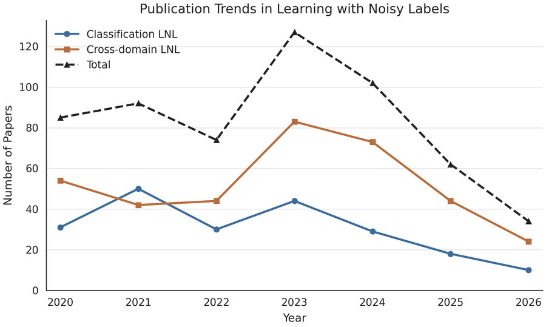
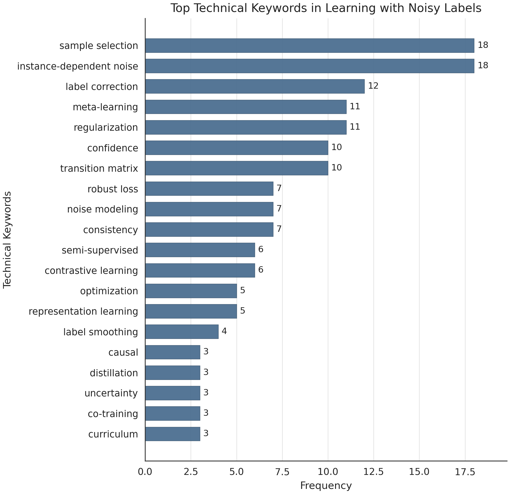
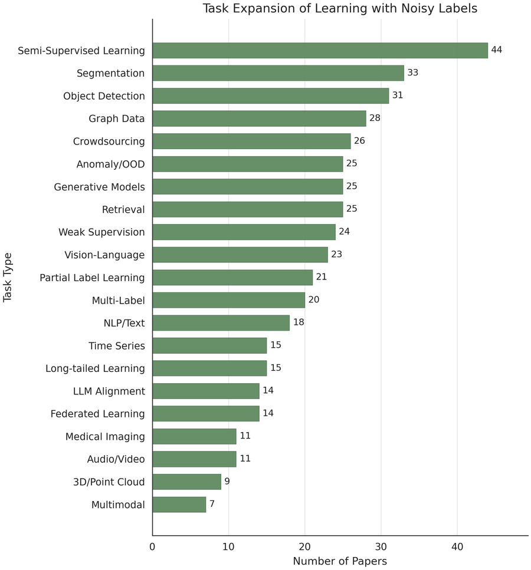
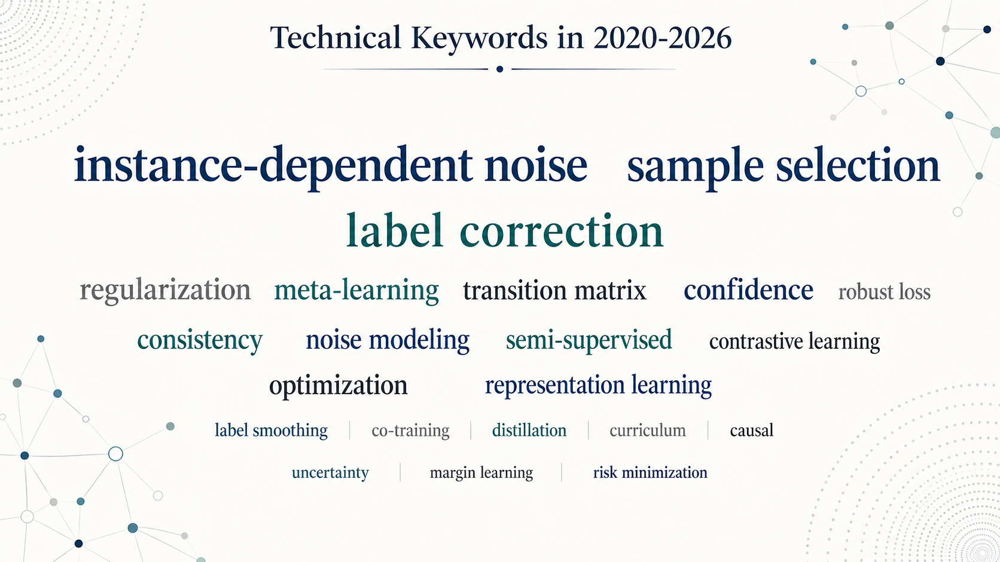

# Learning-with-Noisy-Labels

A curated list of most recent papers & codes in Learning with Noisy Labels.
---------------------------------------------------------------------------

## Tag Legend

### Main Technique

### Task Type

## Statistical Overview

<table>
  <tr>
    <td width="50%" align="center">
      
       
      Publication trends by year and task domain.
    </td>
    <td width="50%" align="center">
      
       
      Top technical keywords in Classification LNL.
    </td>
  </tr>
  <tr>
    <td width="50%" align="center">
      
       
      Task expansion beyond standard classification.
    </td>
    <td width="50%" align="center">
      
       
      Technical keyword word cloud for 2020-2026.
    </td>
  </tr>
</table>

<!-- TASK_TYPE_INDEX_START -->
## Task Type Quick Index

> Paper numbers are clickable and jump to the corresponding entries below. Classification LNL is omitted here because it contains many entries.

### Long-tailed Learning (18)

[P031](#paper-031), [P044](#paper-044), [P067](#paper-067), [P080](#paper-080), [P110](#paper-110), [P160](#paper-160), [P188](#paper-188), [P249](#paper-249), [P285](#paper-285), [P288](#paper-288), [P303](#paper-303), [P305](#paper-305), [P376](#paper-376), [P383](#paper-383), [P548](#paper-548), [P557](#paper-557), [P558](#paper-558), [P585](#paper-585)

### Multi-Label (21)

[P035](#paper-035), [P060](#paper-060), [P132](#paper-132), [P174](#paper-174), [P182](#paper-182), [P190](#paper-190), [P287](#paper-287), [P293](#paper-293), [P308](#paper-308), [P310](#paper-310), [P317](#paper-317), [P332](#paper-332), [P441](#paper-441), [P444](#paper-444), [P475](#paper-475), [P550](#paper-550), [P602](#paper-602), [P642](#paper-642),
[P650](#paper-650), [P651](#paper-651), [P652](#paper-652)

### Graph Data (29)

[P010](#paper-010), [P025](#paper-025), [P040](#paper-040), [P090](#paper-090), [P109](#paper-109), [P117](#paper-117), [P125](#paper-125), [P127](#paper-127), [P140](#paper-140), [P159](#paper-159), [P172](#paper-172), [P173](#paper-173), [P183](#paper-183), [P185](#paper-185), [P189](#paper-189), [P210](#paper-210), [P213](#paper-213), [P229](#paper-229),
[P283](#paper-283), [P310](#paper-310), [P320](#paper-320), [P365](#paper-365), [P387](#paper-387), [P471](#paper-471), [P496](#paper-496), [P551](#paper-551), [P617](#paper-617), [P623](#paper-623), [P631](#paper-631)

### Object Detection (31)

[P041](#paper-041), [P089](#paper-089), [P104](#paper-104), [P151](#paper-151), [P152](#paper-152), [P162](#paper-162), [P163](#paper-163), [P185](#paper-185), [P189](#paper-189), [P227](#paper-227), [P250](#paper-250), [P266](#paper-266), [P267](#paper-267), [P268](#paper-268), [P272](#paper-272), [P290](#paper-290), [P300](#paper-300), [P308](#paper-308),
[P318](#paper-318), [P334](#paper-334), [P358](#paper-358), [P361](#paper-361), [P380](#paper-380), [P381](#paper-381), [P391](#paper-391), [P452](#paper-452), [P531](#paper-531), [P622](#paper-622), [P624](#paper-624), [P625](#paper-625), [P630](#paper-630)

### Segmentation (36)

[P056](#paper-056), [P061](#paper-061), [P063](#paper-063), [P069](#paper-069), [P081](#paper-081), [P106](#paper-106), [P147](#paper-147), [P153](#paper-153), [P155](#paper-155), [P162](#paper-162), [P216](#paper-216), [P243](#paper-243), [P254](#paper-254), [P263](#paper-263), [P270](#paper-270), [P272](#paper-272), [P282](#paper-282), [P286](#paper-286),
[P318](#paper-318), [P325](#paper-325), [P333](#paper-333), [P360](#paper-360), [P361](#paper-361), [P384](#paper-384), [P385](#paper-385), [P392](#paper-392), [P472](#paper-472), [P483](#paper-483), [P549](#paper-549), [P553](#paper-553), [P566](#paper-566), [P582](#paper-582), [P628](#paper-628), [P630](#paper-630), [P646](#paper-646), [P656](#paper-656)

### NLP/Text (69)

[P004](#paper-004), [P005](#paper-005), [P007](#paper-007), [P009](#paper-009), [P011](#paper-011), [P018](#paper-018), [P042](#paper-042), [P045](#paper-045), [P048](#paper-048), [P053](#paper-053), [P082](#paper-082), [P091](#paper-091), [P096](#paper-096), [P124](#paper-124), [P130](#paper-130), [P141](#paper-141), [P142](#paper-142), [P143](#paper-143),
[P144](#paper-144), [P146](#paper-146), [P147](#paper-147), [P191](#paper-191), [P192](#paper-192), [P195](#paper-195), [P218](#paper-218), [P229](#paper-229), [P242](#paper-242), [P246](#paper-246), [P264](#paper-264), [P266](#paper-266), [P272](#paper-272), [P306](#paper-306), [P308](#paper-308), [P312](#paper-312), [P317](#paper-317), [P345](#paper-345),
[P346](#paper-346), [P365](#paper-365), [P390](#paper-390), [P407](#paper-407), [P421](#paper-421), [P425](#paper-425), [P435](#paper-435), [P440](#paper-440), [P446](#paper-446), [P453](#paper-453), [P483](#paper-483), [P488](#paper-488), [P493](#paper-493), [P494](#paper-494), [P502](#paper-502), [P526](#paper-526), [P534](#paper-534), [P537](#paper-537),
[P555](#paper-555), [P560](#paper-560), [P580](#paper-580), [P585](#paper-585), [P597](#paper-597), [P606](#paper-606), [P609](#paper-609), [P610](#paper-610), [P611](#paper-611), [P619](#paper-619), [P621](#paper-621), [P639](#paper-639), [P649](#paper-649), [P652](#paper-652), [P654](#paper-654)

### Vision-Language (22)

[P018](#paper-018), [P023](#paper-023), [P024](#paper-024), [P058](#paper-058), [P059](#paper-059), [P079](#paper-079), [P104](#paper-104), [P129](#paper-129), [P142](#paper-142), [P145](#paper-145), [P154](#paper-154), [P195](#paper-195), [P226](#paper-226), [P242](#paper-242), [P246](#paper-246), [P289](#paper-289), [P365](#paper-365), [P425](#paper-425),
[P426](#paper-426), [P446](#paper-446), [P577](#paper-577), [P608](#paper-608)

### Multimodal (4)

[P062](#paper-062), [P128](#paper-128), [P186](#paper-186), [P319](#paper-319)

### LLM Alignment (14)

[P006](#paper-006), [P007](#paper-007), [P009](#paper-009), [P012](#paper-012), [P013](#paper-013), [P016](#paper-016), [P026](#paper-026), [P049](#paper-049), [P085](#paper-085), [P103](#paper-103), [P111](#paper-111), [P118](#paper-118), [P120](#paper-120), [P378](#paper-378)

### Medical Imaging (14)

[P050](#paper-050), [P059](#paper-059), [P061](#paper-061), [P081](#paper-081), [P108](#paper-108), [P121](#paper-121), [P291](#paper-291), [P293](#paper-293), [P307](#paper-307), [P551](#paper-551), [P582](#paper-582), [P646](#paper-646), [P656](#paper-656), [P657](#paper-657)

### Federated Learning (14)

[P026](#paper-026), [P029](#paper-029), [P034](#paper-034), [P048](#paper-048), [P094](#paper-094), [P161](#paper-161), [P178](#paper-178), [P179](#paper-179), [P180](#paper-180), [P187](#paper-187), [P252](#paper-252), [P253](#paper-253), [P305](#paper-305), [P395](#paper-395)

### Time Series (17)

[P022](#paper-022), [P026](#paper-026), [P042](#paper-042), [P051](#paper-051), [P082](#paper-082), [P087](#paper-087), [P089](#paper-089), [P112](#paper-112), [P211](#paper-211), [P212](#paper-212), [P256](#paper-256), [P284](#paper-284), [P304](#paper-304), [P396](#paper-396), [P481](#paper-481), [P556](#paper-556), [P559](#paper-559)

### Retrieval (29)

[P011](#paper-011), [P027](#paper-027), [P028](#paper-028), [P043](#paper-043), [P084](#paper-084), [P085](#paper-085), [P088](#paper-088), [P131](#paper-131), [P209](#paper-209), [P271](#paper-271), [P274](#paper-274), [P283](#paper-283), [P292](#paper-292), [P359](#paper-359), [P362](#paper-362), [P364](#paper-364), [P388](#paper-388), [P397](#paper-397),
[P409](#paper-409), [P426](#paper-426), [P442](#paper-442), [P469](#paper-469), [P470](#paper-470), [P476](#paper-476), [P532](#paper-532), [P538](#paper-538), [P541](#paper-541), [P611](#paper-611), [P635](#paper-635)

### Generative Models (27)

[P006](#paper-006), [P031](#paper-031), [P053](#paper-053), [P056](#paper-056), [P057](#paper-057), [P059](#paper-059), [P068](#paper-068), [P069](#paper-069), [P107](#paper-107), [P119](#paper-119), [P123](#paper-123), [P124](#paper-124), [P139](#paper-139), [P142](#paper-142), [P209](#paper-209), [P264](#paper-264), [P312](#paper-312), [P345](#paper-345),
[P365](#paper-365), [P425](#paper-425), [P494](#paper-494), [P537](#paper-537), [P620](#paper-620), [P621](#paper-621), [P639](#paper-639), [P652](#paper-652), [P654](#paper-654)

### Audio/Video (11)

[P053](#paper-053), [P082](#paper-082), [P087](#paper-087), [P242](#paper-242), [P246](#paper-246), [P266](#paper-266), [P268](#paper-268), [P284](#paper-284), [P379](#paper-379), [P581](#paper-581), [P584](#paper-584)

### 3D/Point Cloud (9)

[P142](#paper-142), [P214](#paper-214), [P269](#paper-269), [P271](#paper-271), [P290](#paper-290), [P325](#paper-325), [P378](#paper-378), [P566](#paper-566), [P580](#paper-580)

### Anomaly/OOD (28)

[P005](#paper-005), [P023](#paper-023), [P082](#paper-082), [P083](#paper-083), [P089](#paper-089), [P095](#paper-095), [P102](#paper-102), [P143](#paper-143), [P152](#paper-152), [P161](#paper-161), [P176](#paper-176), [P177](#paper-177), [P185](#paper-185), [P189](#paper-189), [P210](#paper-210), [P250](#paper-250), [P268](#paper-268), [P300](#paper-300),
[P316](#paper-316), [P334](#paper-334), [P372](#paper-372), [P377](#paper-377), [P411](#paper-411), [P423](#paper-423), [P527](#paper-527), [P542](#paper-542), [P546](#paper-546), [P567](#paper-567)

### Crowdsourcing (33)

[P017](#paper-017), [P030](#paper-030), [P052](#paper-052), [P102](#paper-102), [P103](#paper-103), [P122](#paper-122), [P133](#paper-133), [P208](#paper-208), [P230](#paper-230), [P241](#paper-241), [P243](#paper-243), [P264](#paper-264), [P265](#paper-265), [P311](#paper-311), [P314](#paper-314), [P325](#paper-325), [P335](#paper-335), [P351](#paper-351),
[P360](#paper-360), [P375](#paper-375), [P424](#paper-424), [P442](#paper-442), [P539](#paper-539), [P544](#paper-544), [P545](#paper-545), [P547](#paper-547), [P554](#paper-554), [P556](#paper-556), [P561](#paper-561), [P581](#paper-581), [P641](#paper-641), [P648](#paper-648), [P652](#paper-652)

### Semi-Supervised Learning (46)

[P010](#paper-010), [P012](#paper-012), [P052](#paper-052), [P062](#paper-062), [P081](#paper-081), [P087](#paper-087), [P153](#paper-153), [P162](#paper-162), [P164](#paper-164), [P171](#paper-171), [P191](#paper-191), [P213](#paper-213), [P216](#paper-216), [P237](#paper-237), [P248](#paper-248), [P251](#paper-251), [P255](#paper-255), [P263](#paper-263),
[P268](#paper-268), [P269](#paper-269), [P284](#paper-284), [P291](#paper-291), [P313](#paper-313), [P317](#paper-317), [P380](#paper-380), [P381](#paper-381), [P386](#paper-386), [P408](#paper-408), [P419](#paper-419), [P442](#paper-442), [P445](#paper-445), [P454](#paper-454), [P455](#paper-455), [P473](#paper-473), [P474](#paper-474), [P483](#paper-483),
[P552](#paper-552), [P585](#paper-585), [P600](#paper-600), [P611](#paper-611), [P618](#paper-618), [P619](#paper-619), [P624](#paper-624), [P629](#paper-629), [P634](#paper-634), [P640](#paper-640)

### Partial Label Learning (22)

[P054](#paper-054), [P055](#paper-055), [P126](#paper-126), [P132](#paper-132), [P174](#paper-174), [P215](#paper-215), [P244](#paper-244), [P309](#paper-309), [P310](#paper-310), [P315](#paper-315), [P330](#paper-330), [P352](#paper-352), [P393](#paper-393), [P394](#paper-394), [P441](#paper-441), [P443](#paper-443), [P444](#paper-444), [P494](#paper-494),
[P545](#paper-545), [P576](#paper-576), [P583](#paper-583), [P651](#paper-651)

### Weak Supervision (24)

[P084](#paper-084), [P181](#paper-181), [P182](#paper-182), [P217](#paper-217), [P231](#paper-231), [P245](#paper-245), [P247](#paper-247), [P272](#paper-272), [P308](#paper-308), [P314](#paper-314), [P363](#paper-363), [P378](#paper-378), [P379](#paper-379), [P385](#paper-385), [P388](#paper-388), [P396](#paper-396), [P425](#paper-425), [P466](#paper-466),
[P472](#paper-472), [P567](#paper-567), [P586](#paper-586), [P601](#paper-601), [P620](#paper-620), [P622](#paper-622)

### Other Tasks (47)

[P008](#paper-008), [P039](#paper-039), [P047](#paper-047), [P086](#paper-086), [P100](#paper-100), [P101](#paper-101), [P138](#paper-138), [P175](#paper-175), [P206](#paper-206), [P207](#paper-207), [P228](#paper-228), [P239](#paper-239), [P240](#paper-240), [P273](#paper-273), [P324](#paper-324), [P331](#paper-331), [P350](#paper-350), [P373](#paper-373),
[P374](#paper-374), [P406](#paper-406), [P422](#paper-422), [P436](#paper-436), [P437](#paper-437), [P438](#paper-438), [P439](#paper-439), [P468](#paper-468), [P482](#paper-482), [P528](#paper-528), [P529](#paper-529), [P530](#paper-530), [P533](#paper-533), [P535](#paper-535), [P536](#paper-536), [P540](#paper-540), [P543](#paper-543), [P573](#paper-573),
[P578](#paper-578), [P579](#paper-579), [P598](#paper-598), [P599](#paper-599), [P607](#paper-607), [P632](#paper-632), [P633](#paper-633), [P636](#paper-636), [P637](#paper-637), [P647](#paper-647), [P655](#paper-655)

<!-- TASK_TYPE_INDEX_END -->

## 🧰 Public Software

**Docta-AI:**
An advanced data-centric AI platform that detects and rectifies issues in any data format (i.e., label error detection). [[Website]](https://github.com/Docta-ai/docta)

## 🎓 Tutorial

**1st Learning and Mining with Noisy Labels Challenge** (IJCAI 2023)[[Website]](https://sites.google.com/ucsc.edu/tutorial-noisylabels/home)[[GitHub]](https://github.com/Docta-ai/IJCAI-tutorial)

## 📦 Content

- [Task Type Quick Index](#task-type-quick-index)
- [Benchmarks](#benchmarks)
- [Papers & Code in 2026](#papers--code-in-2026)
  - [ICLR 2026](#iclr-2026)
  - [CVPR 2026](#cvpr-2026)
  - [AAAI 2026](#aaai-2026)
  - [WACV 2026](#wacv-2026)
  - [Top Journals 2026](#top-journals-2026)
- [Papers & Code in 2025](#papers--code-in-2025)
  - [NeurIPS 2025](#neurips-2025)
  - [ICML 2025](#icml-2025)
  - [ICLR 2025](#iclr-2025)
  - [CVPR 2025](#cvpr-2025)
  - [ICCV 2025](#iccv-2025)
  - [AAAI 2025](#aaai-2025)
  - [Other Conferences 2025](#other-conferences-2025)
  - [Top Journals 2025](#top-journals-2025)
- [Papers & Code in 2024](#papers--code-in-2024)
  - [Neurips 2024](#neurips-2024)
  - [ICML 2024](#icml-2024)
  - [ICLR 2024](#iclr-2024)
  - [CVPR 2024](#cvpr-2024)
  - [ECCV 2024](#eccv-2024)
  - [AAAI 2024](#aaai-2024)
  - [IJCAI 2024](#ijcai-2024)
  - [KDD 2024](#kdd-2024)
  - [ACM MM 2024](#acm-mm-2024)
  - [Top Journals 2024](#top-journals-2024)
- [Papers & Code in 2023](#papers--code-in-2023)
  - [NeurIPS 2023](#neurips-2023)
  - [ICML 2023](#icml-2023)
  - [ICLR 2023](#iclr-2023)
  - [CVPR 2023](#cvpr-2023)
  - [ICCV 2023](#iccv-2023)
  - [AAAI 2023](#aaai-2023)
  - [IJCAI 2023](#ijcai-2023)
  - [KDD 2023](#kdd-2023)
  - [ACM MM 2023](#acm-mm-2023)
  - [Top Journals 2023](#top-journals-2023)
- [Papers & Code in 2022](#papers--code-in-2022)
  - [NeurIPS 2022](#neurips-2022)
  - [ICML 2022](#icml-2022)
  - [ICLR 2022](#iclr-2022)
  - [CVPR 2022](#cvpr-2022)
  - [ECCV 2022](#eccv-2022)
  - [AAAI 2022](#aaai-2022)
  - [IJCAI 2022](#ijcai-2022)
  - [KDD 2022](#kdd-2022)
  - [ACM MM 2022](#acm-mm-2022)
  - [ArXiv 2022](#arxiv-2022)
  - [Top Journals 2022](#top-journals-2022)
- [Papers & Code in 2021](#papers--code-in-2021)
  - [NeurIPS 2021](#neurips-2021)
  - [ICML 2021](#icml-2021)
  - [ICLR 2021](#iclr-2021)
  - [CVPR 2021](#cvpr-2021)
  - [ICCV 2021](#iccv-2021)
  - [AAAI 2021](#aaai-2021)
  - [IJCAI 2021](#ijcai-2021)
  - [KDD 2021](#kdd-2021)
  - [ACM MM 2021](#acm-mm-2021)
  - [ArXiv 2021](#arxiv-2021)
  - [Other Conferences 2021](#other-conferences-2021)
- [Papers & Code in 2020](#papers--code-in-2020)
  - [NIPS 2020](#nips-2020)
  - [ICML 2020](#icml-2020)
  - [ICLR 2020](#iclr-2020)
  - [CVPR 2020](#cvpr-2020)
  - [ECCV 2020](#eccv-2020)
  - [AAAI 2020](#aaai-2020)
  - [IJCAI 2020](#ijcai-2020)
  - [KDD 2020](#kdd-2020)
  - [ArXiv 2020](#arxiv-2020)
---

## 📊 Benchmarks

Real-world noisy-label bechmarks:

| Dataset           | Noise Rate                        | Website                                                                         | Paper                                                                                                         |
| ----------------- | --------------------------------- | ------------------------------------------------------------------------------- | ------------------------------------------------------------------------------------------------------------- |
| CIFAR-10N         | ~8%/~20%/~40% (human label noise) | [[Website]](http://noisylabels.com/)                                               | [[Paper]](https://arxiv.org/abs/2110.12088)                                                                      |
| CIFAR-100N        | ~40% (human label noise)          | [[Website]](http://noisylabels.com/)                                               | [[Paper]](https://arxiv.org/abs/2110.12088)                                                                      |
| Red Stanford Cars | ~40% (synthetic noise)            | [[Website]](https://ai.googleblog.com/2020/08/understanding-deep-learning-on.html) | [[Paper]](http://proceedings.mlr.press/v119/jiang20c/jiang20c.pdf)                                               |
| Red Mini-ImageNet | ~40% (synthetic noise)            | [[Website]](https://ai.googleblog.com/2020/08/understanding-deep-learning-on.html) | [[Paper]](http://proceedings.mlr.press/v119/jiang20c/jiang20c.pdf)                                               |
| Animal-10N        | ~8% (real-world noise)            | [[Website]](https://dm.kaist.ac.kr/datasets/animal-10n/)                           | [[Paper]](http://proceedings.mlr.press/v97/song19b.html)                                                         |
| Food-101N         | ~20% (human label noise)          | [[Website]](https://github.com/kuanghuei/clean-net)                                | [[Paper]](https://arxiv.org/pdf/1711.07131.pdf)                                                                  |
| Clothing1M        | ~38% (real-world noise)           | [[Website]](https://github.com/Cysu/noisy_label)                                   | [[Paper]](https://openaccess.thecvf.com/content_cvpr_2015/papers/Xiao_Learning_From_Massive_2015_CVPR_paper.pdf) |

## 🔧 Simulation of Label Noise

### 🧩 Instance-Dependent Noise (IDN)

- **Part-dependent Label Noise: Towards Instance-dependent Label Noise**
  [[Paper]](https://arxiv.org/abs/2006.07836) [[Code]](https://github.com/xiaoboxia/Part-dependent-label-noise)
- **Beyond Class-Conditional Assumption: A Primary Attempt to Combat Instance-Dependent Label Noise**
  [[Paper]](https://arxiv.org/abs/2012.05458) [[Code]](https://github.com/chenpf1025/IDN)
- **An Instance-Dependent Simulation Framework for Learning with Label Noise**
  [[Paper]](https://arxiv.org/abs/2107.11413)

---

### 🔀 Polynomial Margin Diminishing Noise (PMD)

- **Learning with Feature-Dependent Label Noise: A Progressive Approach**
  [[Paper]](https://openreview.net/pdf?id=ZPa2SyGcbwh) [[Code]](https://github.com/pxiangwu/PLC)

---

> <strong>Note:</strong> This repository mainly focuses on papers published after 2019. For earlier works, please refer to [[this curated list]](https://github.com/subeeshvasu/Awesome-Learning-with-Label-Noise).

## Papers & Code in 2026

---

### ICLR 2026

*  **[P001]** Enhancing Learning with Noisy Labels via Rockafellian Relaxation.
  
  
  [[Paper]](https://openreview.net/forum?id=g4EpGiN5X3)
*  **[P002]** TrainRef: Curating Data with Label Distribution and Minimal Reference for Accurate Prediction and Reliable Confidence.
  
  
  
  [[Paper]](https://openreview.net/forum?id=jSs8CDsF0A)
*  **[P003]** Resurfacing the Instance-only Dependent Label Noise Model through Loss Correction.
  
  
  
  
  [[Paper]](https://openreview.net/forum?id=tuvkrivvbG)
*  **[P004]** LANE: Label-Aware Noise Elimination for Fine-Grained Text Classification.
  
  
  [[Paper]](https://openreview.net/forum?id=PuayLKdrFz)
*  **[P005]** Noise-Aware Generalization: Robustness to In-Domain Noise and Out-of-Domain Generalization.
  
  
  
  [[Paper]](https://openreview.net/forum?id=wb83wO41QT)
*  **[P006]** Learning from Noisy Preferences: A Semi-Supervised Learning Approach to Direct Preference Optimization.
  
  
  
  [[Paper]](https://openreview.net/forum?id=rRc04jyoAk)
*  **[P007]** RE-PO: Robust Enhanced Policy Optimization as a General Framework for LLM Alignment.
  
  
  
  
  [[Paper]](https://openreview.net/forum?id=jDKpOvTCM8)
*  **[P008]** Conformal Prediction with Corrupted Labels: Uncertain Imputation and Robust Re-weighting.
  
  
  
  [[Paper]](https://iclr.cc/virtual/2026/poster/10006410)
*  **[P009]** Aligner, Diagnose Thyself: A Meta-Learning Paradigm for Fusing Intrinsic Feedback in Preference Alignment.
  
  
  
  
  
  [[Paper]](https://iclr.cc/virtual/2026/poster/10007430)
*  **[P010]** GNN-as-Judge: Unleashing the Power of LLMs for Graph Few-shot Semi-supervised Learning with GNN Feedback.
  
  
  
  
  [[Paper]](https://iclr.cc/virtual/2026/poster/10007476)
*  **[P011]** Task-Aware Data Selection via Proxy-Label Enhanced Distribution Matching for LLM Finetuning.
  
  
  
  [[Paper]](https://iclr.cc/virtual/2026/poster/10009535)
*  **[P012]** Noisy-Pair Robust Representation Alignment for Positive-Unlabeled Learning.
  
  
  
  
  [[Paper]](https://iclr.cc/virtual/2026/poster/10006926)
*  **[P013]** Align-SAM: Seeking Flatter Minima for Better Cross-Subset Alignment.
  
  
  
  
  [[Paper]](https://iclr.cc/virtual/2026/poster/10009992)

---

---

### CVPR 2026

*  **[P014]** Deconstructing the Failure of Ideal Noise Correction: A Three-Pillar Diagnosis.
  
  
  
  [[Paper]](https://arxiv.org/abs/2603.12997)
*  **[P015]** Debiased Sample Selection for Learning with Noisy Labels.
  
  
  [[Paper]](https://www.eric-weiwei.com/)
*  **[P016]** Beyond Loss Values: Robust Dynamic Pruning via Loss Trajectory Alignment.
  
  
  
  [[Paper]](https://arxiv.org/abs/2604.07306)
*  **[P017]** KαLOS finds Consensus: A Meta-Algorithm for Evaluating Inter-Annotator Agreement in Complex Vision Tasks.
  
  
  
  [[Paper]](https://www.uni-weimar.de/en/media/chairs/computer-science-department/computer-vision/publications/)
*  **[P018]** Text-Anchored Guided Optimization for Robust Fine-tuning Vision-Language Models under Label Noise.
  
  
  
  [[Paper]](https://www.eric-weiwei.com/)

---

---

### AAAI 2026

*  **[P019]** Leveraging Dissimilarity Invariance as a Robust Anchor for Learning with Noisy Labels.
  
  
  
  [[Paper]](https://ojs.aaai.org/index.php/AAAI/article/view/37381)
*  **[P020]** On the Learning Dynamics of Two-layer Linear Networks with Label Noise SGD.
  
  
  
  [[Paper]](https://arxiv.org/abs/2603.10397)
*  **[P021]** Is the Information Bottleneck Robust Enough? Towards Label-Noise Resistant Information Bottleneck Learning.
  
  
  
  [[Paper]](https://arxiv.org/abs/2512.10573)
*  **[P022]** Jump-teaching: Combating Sample Selection Bias via Temporal Disagreement.
  
  
  [[Paper]](https://arxiv.org/abs/2405.17137)
*  **[P023]** Content Diversity-guided Ambiguity Mitigation for Open-Set Noisy Label Learning.
  
  
  
  
  [[Paper]](https://ojs.aaai.org/index.php/AAAI/article/view/38398)
*  **[P024]** Mitigating Endogenous Confirmation Bias in Noisy Label Learning for Vision-Language Models.
  
  
  [[Paper]](https://ojs.aaai.org/index.php/AAAI/article/view/39641/43602)
*  **[P025]** Prototype-Guided Supervision for Graph Learning with Noisy and Sparse Labels.
  
  
  
  [[Paper]](https://ojs.aaai.org/index.php/AAAI/article/view/39477)
*  **[P026]** FedRNC: Addressing Spatio-Temporal Label Misalignment in Federated Noisy Class-Incremental Learning.
  
  
  
  
  
  [[Paper]](https://ojs.aaai.org/index.php/AAAI/article/view/39359)
*  **[P027]** Neighbor-aware Instance Refining with Noisy Labels for Cross-Modal Retrieval.
  
  
  
  [[Paper]](https://arxiv.org/abs/2512.24064)
*  **[P028]** Meta-Guided Sample Reweighting for Robust Cross-Modal Hashing Retrieval with Noisy Labels.
  
  
  
  
  [[Paper]](https://ojs.aaai.org/index.php/AAAI/article/view/37894)

---

### WACV 2026

*  **[P029]** FedEFC: Federated Learning Using Enhanced Forward Correction Against Noisy Labels.
  
  
  
  [[Paper]](https://openaccess.thecvf.com/content/WACV2026/html/Yu_FedEFC_Federated_Learning_Using_Enhanced_Forward_Correction_Against_Noisy_Labels_WACV_2026_paper.html)
*  **[P030]** Reciprocal Teaching: Dynamic Multi-Model Teacher-Student Learning for Multiple Noisy Annotations.
  
  
  
  [[Paper]](https://openaccess.thecvf.com/content/WACV2026/html/Ai_Reciprocal_Teaching_Dynamic_Multi-Model_Teacher-Student_Learning_for_Multiple_Noisy_Annotations_WACV_2026_paper.html)

---

---

### Top Journals 2026

*  **[P031]** [[**Sxu**]](https://github.com/SenyuHou) Class-Aware Multi-Granularity Co-Diffusion Models for Learning With Noisy Labels on Imbalanced Datasets. (Published on TKDE)
  
  
  
  
  [[Paper]](https://doi.org/10.1109/TKDE.2026.3650911)[[Code]](https://github.com/SenyuHou/CaMCoD)
*  **[P032]** Continuous Review and Timely Correction: Enhancing the Resistance to Noisy Labels via Self-Not-True and Class-Wise Distillation. (Published on TPAMI)
  
  
  [[Paper]](https://doi.org/10.1109/TPAMI.2025.3649111)
*  **[P033]** Affinity-aware Uncertainty Quantification for Learning with Noisy Labels. (Published on Pattern Recognition)
  
  
  [[Paper]](https://www.sciencedirect.com/science/article/pii/S0031320325011586)
*  **[P034]** Federated Learning with Noisy Labels: A Comprehensive and Concise Review of Current Methodologies and Future Directions. (Published on Neural Networks)
  
  
  
  [[Paper]](https://www.sciencedirect.com/science/article/abs/pii/S0893608026003503)

## Papers & Code in 2025

---

### NeurIPS 2025

*  **[P035]** [[**Sxu**]](https://github.com/SenyuHou) Noisy Multi-Label Learning through Co-Occurrence-Aware Diffusion.
  
  
  [[Paper]](https://neurips.cc/virtual/2025/poster/115033)
*  **[P036]** Learning to Clean: Reinforcement Learning for Noisy Label Correction.
  
  
  [[Paper]](https://nips.cc/virtual/2025/poster/115438)
*  **[P037]** Enhancing Sample Selection Against Label Noise by Cutting Mislabeled Easy Examples.
  
  
  [[Paper]](https://neurips.cc/virtual/2025/poster/118281)
*  **[P038]** Handling Label Noise via Instance-Level Difficulty Modeling and Dynamic Optimization.
  
  
  [[Paper]](https://nips.cc/virtual/2025/poster/116524)[[Code]](https://github.com/iTheresaApocalypse/IDO)
*  **[P039]** Self-Boost via Optimal Retraining: An Analysis via Approximate Message Passing.
  
  
  
  [[Paper]](https://neurips.cc/virtual/2025/poster/116800)
*  **[P040]** GD$^2$: Robust Graph Learning under Label Noise via Dual-View Prediction Discrepancy.
  
  
  
  [[Paper]](https://neurips.cc/virtual/2025/poster/115580)
*  **[P041]** ELDET: Early-Learning Distillation with Noisy Labels for Object Detection.
  
  
  
  
  [[Paper]](https://neurips.cc/virtual/2025/poster/118794)
*  **[P042]** FlowRefiner: A Robust Traffic Classification Framework against Label Noise.
  
  
  
  [[Paper]](https://nips.cc/virtual/2025/poster/118975)
*  **[P043]** SEGA: Shaping Semantic Geometry for Robust Hashing under Noisy Supervision.
  
  
  
  [[Paper]](https://proceedings.neurips.cc/paper_files/paper/2025/hash/0663a39baab211328fc865f91abc75ab-Abstract-Conference.html)
*  **[P044]** Unlocker: Disentangle the Deadlock of Learning between Label-noisy and Long-tailed Data.
  
  
  
  
  [[Paper]](https://proceedings.neurips.cc/paper_files/paper/2025/hash/bcfcf7232cb74e1ef82d751880ff835b-Abstract-Conference.html)
*  **[P045]** How Does Label Noise Gradient Descent Improve Generalization in the Low SNR Regime?
  
  
  
  [[Paper]](https://proceedings.neurips.cc/paper_files/paper/2025/hash/ffab50f3cad7cb5733ca324e5be20976-Abstract-Conference.html)

---

### ICML 2025

*  **[P046]** On the Role of Label Noise in the Feature Learning Process.
  
  
  
  [[Paper]](https://proceedings.mlr.press/v267/han25c.html)
*  **[P047]** Retraining with Predicted Hard Labels Provably Increases Model Accuracy.
  
  
  
  [[Paper]](https://proceedings.mlr.press/v267/das25b.html)
*  **[P048]** FedClean: A General Robust Label Noise Correction for Federated Learning.
  
  
  
  [[Paper]](https://proceedings.mlr.press/v267/jiang25m.html)
*  **[P049]** A Unified Theoretical Analysis of Private and Robust Offline Alignment: from RLHF to DPO.
  
  
  
  [[Paper]](https://proceedings.mlr.press/v267/zhou25ac.html)

---

---

### ICLR 2025

*  **[P050]** Regretful Decisions under Label Noise.
  
  
  
  [[Paper]](https://openreview.net/forum?id=7B9FCDoUzB)
*  **[P051]** Learning under Temporal Label Noise.
  
  
  [[Paper]](https://openreview.net/forum?id=5o0phqAhsP)
*  **[P052]** Learning from Weak Labelers as Constraints.
  
  
  
  
  [[Paper]](https://openreview.net/forum?id=2BtFKEeMGo)
*  **[P053]** Learning to Generate Diverse Pedestrian Movements from Web Videos with Noisy Labels.
  
  
  
  
  [[Paper]](https://openreview.net/forum?id=DydCqKa6AH)[[Code]](https://genforce.github.io/PedGen/)
*  **[P054]** Noise Separation guided Candidate Label Reconstruction for Noisy Partial Label Learning.
  
  
  
  [[Paper]](https://proceedings.iclr.cc/paper_files/paper/2025/hash/a8b879590adff2b1874f97db59b65518-Abstract-Conference.html)
*  **[P055]** Rethinking Self-Distillation: Label Averaging and Enhanced Soft Label Refinement with Partial Labels.
  
  
  
  [[Paper]](https://proceedings.iclr.cc/paper_files/paper/2025/hash/9d4824d834b5fe8e6b53dcfe42cab8d2-Abstract-Conference.html)
*  **[P056]** Multi-Task Dense Predictions via Unleashing the Power of Diffusion.
  
  
  
  [[Paper]](https://proceedings.iclr.cc/paper_files/paper/2025/hash/2f2b1d6bbd50865eca40e2774a057eef-Abstract-Conference.html)

---

---

### CVPR 2025

*  **[P057]** [[**Sxu**]](https://github.com/SenyuHou) Directional Label Diffusion Model for Learning from Noisy Labels.
  
  
  
  [[Paper]](https://openaccess.thecvf.com/content/CVPR2025/html/Hou_Directional_Label_Diffusion_Model_for_Learning_from_Noisy_Labels_CVPR_2025_paper.html)[[Code]](https://github.com/SenyuHou/DLD)
*  **[P058]** NLPrompt: Noise-Label Prompt Learning for Vision-Language Models.
  
  
  [[Paper]](https://openaccess.thecvf.com/content/CVPR2025/html/Pan_NLPrompt_Noise-Label_Prompt_Learning_for_Vision-Language_Models_CVPR_2025_paper.html)
*  **[P059]** DiN: Diffusion Model for Robust Medical VQA with Semantic Noisy Labels.
  
  
  
  
  [[Paper]](https://openaccess.thecvf.com/content/CVPR2025/html/Guo_DiN_Diffusion_Model_for_Robust_Medical_VQA_with_Semantic_Noisy_CVPR_2025_paper.html)
*  **[P060]** Theory-Inspired Deep Multi-View Multi-Label Learning with Incomplete Views and Noisy Labels.
  
  
  
  [[Paper]](https://openaccess.thecvf.com/content/CVPR2025/html/Li_Theory-Inspired_Deep_Multi-View_Multi-Label_Learning_with_Incomplete_Views_and_Noisy_CVPR_2025_paper.html)
*  **[P061]** Minding Fuzzy Regions: A Data-driven Alternating Learning Paradigm for Stable Lesion Segmentation.
  
  
  
  [[Paper]](https://openaccess.thecvf.com/content/CVPR2025/html/Fang_Minding_Fuzzy_Regions_A_Data-driven_Alternating_Learning_Paradigm_for_Stable_CVPR_2025_paper.html)
*  **[P062]** ROLL: Robust Noisy Pseudo-label Learning for Multi-View Clustering with Noisy Correspondence.
  
  
  
  
  
  [[Paper]](https://openaccess.thecvf.com/content/CVPR2025/html/Sun_ROLL_Robust_Noisy_Pseudo-label_Learning_for_Multi-View_Clustering_with_Noisy_CVPR_2025_paper.html)
*  **[P063]** The Impact Label Noise and Choice of Threshold has on Cross-Entropy and Soft-Dice in Image Segmentation.
  
  
  
  [[Paper]](https://openaccess.thecvf.com/content/CVPR2025/html/Nordstrom_The_Impact_Label_Noise_and_Choice_of_Threshold_has_on_CVPR_2025_paper.html)

---

---

### ICCV 2025

*  **[P064]** CA2C: A Prior-Knowledge-Free Approach for Robust Label Noise Learning via Asymmetric Co-learning and Co-training.
  
  
  
  [[Paper]](https://openaccess.thecvf.com/content/ICCV2025/html/Sheng_CA2C_A_Prior-Knowledge-Free_Approach_for_Robust_Label_Noise_Learning_via_ICCV_2025_paper.html)
*  **[P065]** Meta-Learning Dynamic Center Distance: Hard Sample Mining for Learning with Noisy Labels.
  
  
  
  [[Paper]](https://openaccess.thecvf.com/content/ICCV2025/html/Mu_Meta-Learning_Dynamic_Center_Distance_Hard_Sample_Mining_for_Learning_with_ICCV_2025_paper.html)
*  **[P066]** Joint Asymmetric Loss for Learning with Noisy Labels.
  
  
  
  [[Paper]](https://openaccess.thecvf.com/content/ICCV2025/html/Wang_Joint_Asymmetric_Loss_for_Learning_with_Noisy_Labels_ICCV_2025_paper.html)[[Code]](https://github.com/cswjl/joint-asymmetric-loss)
*  **[P067]** Boosting Class Representation via Semantically Related Instances for Robust Long-Tailed Learning with Noisy Labels.
  
  
  
  [[Paper]](https://openaccess.thecvf.com/content/ICCV2025/html/Li_Boosting_Class_Representation_via_Semantically_Related_Instances_for_Robust_Long-Tailed_ICCV_2025_paper.html)[[Code]](https://github.com/yhli-ml/IBC)
*  **[P068]** Guiding Noisy Label Conditional Diffusion Models with Score-based Discriminator Correction.
  
  
  
  [[Paper]](https://openaccess.thecvf.com/content/ICCV2025/html/Cong_Guiding_Noisy_Label_Conditional_Diffusion_Models_with_Score-based_Discriminator_Correction_ICCV_2025_paper.html)
*  **[P069]** Images as Noisy Labels: Unleashing the Potential of the Diffusion Model for Open-Vocabulary Semantic Segmentation.
  
  
  
  [[Paper]](https://openaccess.thecvf.com/content/ICCV2025/html/Li_Images_as_Noisy_Labels_Unleashing_the_Potential_of_the_Diffusion_ICCV_2025_paper.html)

---

---

### AAAI 2025

*  **[P070]** Combating Semantic Contamination in Learning with Label Noise.
  
  
  
  [[Paper]](https://ojs.aaai.org/index.php/AAAI/article/view/32293)
*  **[P071]** Enhancing Noise-Robust Losses for Large-Scale Noisy Data Learning.
  
  
  [[Paper]](https://ojs.aaai.org/index.php/AAAI/article/view/32752)
*  **[P072]** SAP: Corrective Machine Unlearning with Scaled Activation Projection for Label Noise Robustness.
  
  
  
  
  [[Paper]](https://ojs.aaai.org/index.php/AAAI/article/view/33972)
*  **[P073]** Learning Causal Transition Matrix for Instance-dependent Label Noise.
  
  
  [[Paper]](https://arxiv.org/abs/2412.13516)
*  **[P074]** Label Noise Correction via Fuzzy Learning Machine.
  
  
  
  [[Paper]](https://ojs.aaai.org/index.php/AAAI/article/view/34055)
*  **[P075]** Enhanced Sample Selection with Confidence Tracking: Identifying Correctly Labeled Yet Hard-to-Learn Samples in Noisy Data.
  
  
  
  [[Paper]](https://arxiv.org/abs/2504.17474)
*  **[P076]** Noisy Label Calibration for Multi-View Classification.
  
  
  [[Paper]](https://ojs.aaai.org/index.php/AAAI/article/view/35485/37640)
*  **[P077]** Revisiting Interpolation for Noisy Label Correction.
  
  
  
  [[Paper]](https://ojs.aaai.org/index.php/AAAI/article/view/35489)
*  **[P078]** Learning from Noisy Labels via Self-Taught On-the-Fly Meta Loss Rescaling.
  
  
  [[Paper]](https://arxiv.org/abs/2412.12955)
*  **[P079]** Optimized Gradient Clipping for Noisy Label Learning.
  
  
  [[Paper]](https://arxiv.org/abs/2412.08941)
*  **[P080]** Robust Logit Adjustment for Learning with Long-Tailed Noisy Data.
  
  
  
  [[Paper]](https://openreview.net/forum?id=PQ43wVvbvz)
*  **[P081]** Weakly Supervised Gland Segmentation with Class Semantic Consistency and Purified Labels Filtration.
  
  
  
  
  
  
  
  [[Paper]](https://ojs.aaai.org/index.php/AAAI/article/view/32306)
*  **[P082]** Energy vs. Noise: Towards Robust Temporal Action Localization in Open-World.
  
  
  
  
  
  
  [[Paper]](https://ojs.aaai.org/index.php/AAAI/article/view/32659)
*  **[P083]** Learning with Open-world Noisy Data via Class-independent Margin in Dual Representation Space.
  
  
  
  [[Paper]](https://ojs.aaai.org/index.php/AAAI/article/view/32673)
*  **[P084]** Relieving Universal Label Noise for Unsupervised Visible-Infrared Person Re-Identification by Inferring from Neighbors.
  
  
  
  
  
  [[Paper]](https://ojs.aaai.org/index.php/AAAI/article/view/32791)
*  **[P085]** RoDA: Robust Domain Alignment for Cross-Domain Retrieval Against Label Noise.
  
  
  
  
  [[Paper]](https://ojs.aaai.org/index.php/AAAI/article/view/33033)
*  **[P086]** RepFace: Refining Closed-Set Noise with Progressive Label Correction for Face Recognition.
  
  
  
  [[Paper]](https://ojs.aaai.org/index.php/AAAI/article/view/33077)
*  **[P087]** Rethinking Pseudo-Label Guided Learning for Weakly Supervised Temporal Action Localization from the Perspective of Noise Correction.
  
  
  
  
  
  [[Paper]](https://ojs.aaai.org/index.php/AAAI/article/view/33094)
*  **[P088]** Robust Self-Paced Hashing for Cross-Modal Retrieval with Noisy Labels.
  
  
  
  [[Paper]](https://ojs.aaai.org/index.php/AAAI/article/view/34199)

---

### Other Conferences 2025

*  **[P089]** (KDD 2025) Noise-Resilient Point-wise Anomaly Detection in Time Series Using Weak Segment Labels.
  
  
  
  
  [[Paper]](https://doi.org/10.1145/3690624.3709257)
*  **[P090]** (IJCAI 2025) Leveraging Peer-Informed Label Consistency for Robust Graph Neural Networks with Noisy Labels.
  
  
  
  [[Paper]](https://www.ijcai.org/proceedings/2025/623)
*  **[P091]** (AISTATS 2025) AlleNoise - Large-scale Text Classification Benchmark Dataset with Real-world Label Noise.
  
  
  
  
  [[Paper]](https://proceedings.mlr.press/v258/raczkowska25a.html)[[Code]](https://github.com/allegro/AlleNoise)

---

---

### Top Journals 2025

*  **[P092]** SplitNet: Learnable Clean-Noisy Label Splitting for Learning with Noisy Labels. (Published on IJCV)
  
  
  [[Paper]](https://link.springer.com/article/10.1007/s11263-024-02187-4)
*  **[P093]** Improving the Instance-Dependent Transition Matrix Estimation by Exploiting Self-Supervised Learning. (Published on TPAMI)
  
  
  [[Paper]](https://doi.org/10.1109/TPAMI.2025.3595613)
*  **[P094]** FedELR: When Federated Learning Meets Learning with Noisy Labels. (Published on Neural Networks)
  
  
  [[Paper]](https://www.sciencedirect.com/science/article/pii/S0893608025001546)
*  **[P095]** Learning from Open-set Noisy Labels Based on Multi-prototype Modeling. (Published on Pattern Recognition)
  
  
  [[Paper]](https://www.sciencedirect.com/science/article/pii/S0031320324006538)
*  **[P096]** A Survey on Learning with Noisy Labels in Natural Language Processing: How to Train Models with Label Noise. (Published on Engineering Applications of Artificial Intelligence)
  
  
  
  [[Paper]](https://www.sciencedirect.com/science/article/pii/S0952197625001575)

## Papers & Code in 2024

---

### Neurips 2024

*  **[P097]** Learning the Latent Causal Structure for Modeling Label Noise.
  
  
  [[Paper]](https://nips.cc/virtual/2024/poster/93700)
*  **[P098]** Learning from Noisy Labels via Conditional Distributionally Robust Optimization.
  
  
  [[Paper]](https://nips.cc/virtual/2024/poster/96820)
*  **[P099]** Label Noise: Ignorance Is Bliss.
  
  
  
  [[Paper]](https://nips.cc/virtual/2024/poster/94205)
*  **[P100]** Sample Selection via Contrastive Fragmentation for Noisy Label Regression.
  
  
  
  [[Paper]](https://nips.cc/virtual/2024/poster/95898)
*  **[P101]** Robust Contrastive Multi-view Clustering against Dual Noisy Correspondence.
  
  
  [[Paper]](https://nips.cc/virtual/2024/poster/96528)
*  **[P102]** Noisy Label Learning with Instance-Dependent Outliers: Identifiability via Crowd Wisdom.
  
  
  
  
  [[Paper]](https://nips.cc/virtual/2024/poster/95831)
*  **[P103]** Entity Alignment with Noisy Annotations from Large Language Models.
  
  
  
  
  [[Paper]](https://nips.cc/virtual/2024/poster/93478)
*  **[P104]** Vision-Language Models are Strong Noisy Label Detectors.
  
  
  
  [[Paper]](https://nips.cc/virtual/2024/poster/94056)
*  **[P105]** Benchmarking the Reasoning Robustness against Noisy Rationales in Chain-of-thought Prompting.
  
  
  
  [[Paper]](https://nips.cc/virtual/2024/poster/95956)
*  **[P106]** CoSW: Conditional Sample Weighting for Smoke Segmentation with Label Noise.
  
  
  [[Paper]](https://nips.cc/virtual/2024/poster/95170)
*  **[P107]** Immiscible Diffusion: Accelerating Diffusion Training with Noise Assignment.
  
  
  [[Paper]](https://nips.cc/virtual/2024/poster/93906)
*  **[P108]** Curriculum Fine-tuning of Vision Foundation Model for Medical Image Classification Under Label Noise.
  
  
  
  [[Paper]](https://nips.cc/virtual/2024/poster/93198)[[Code]](https://github.com/gist-ailab/CUFIT)
*  **[P109]** NoisyGL: A Comprehensive Benchmark for Graph Neural Networks under Label Noise.
  
  
  
  
  [[Paper]](https://nips.cc/virtual/2024/poster/97611)
*  **[P110]** Noisy Ostracods: A Fine-Grained, Imbalanced Real-World Dataset for Benchmarking Robust Machine Learning and Label Correction Methods.
  
  
  
  [[Paper]](https://nips.cc/virtual/2024/poster/97733)
*  **[P111]** Perplexity-aware Correction for Robust Alignment with Noisy Preferences.
  
  
  
  [[Paper]](https://nips.cc/virtual/2024/poster/95367)
*  **[P112]** Information-theoretic Limits of Online Classification with Noisy Labels.
  
  
  
  [[Paper]](https://nips.cc/virtual/2024/poster/95650)

---

---

### ICML 2024

*  **[P113]** Pi-DUAL: Using privileged information to distinguish clean from noisy labels.
  
  
  [[Paper]](https://proceedings.mlr.press/v235/wang24bb.html)
*  **[P114]** Self-cognitive Denoising in the Presence of Multiple Noisy Label Sources.
  
  
  [[Paper]](https://proceedings.mlr.press/v235/sun24o.html)
*  **[P115]** (KDD 2025) CLID-MU: Cross-Layer Information Divergence Based Meta Update Strategy for Learning with Noisy Labels.
  
  
  
  [[Paper]](https://doi.org/10.1145/3711896.3736880)
*  **[P116]** (IJCAI 2025) COLUR: Confidence-Oriented Learning, Unlearning and Relearning with Noisy-Label Data for Model Restoration and Refinement.
  
  
  
  [[Paper]](https://www.ijcai.org/proceedings/2025/1038)
*  **[P117]** Mitigating Label Noise on Graphs via Topological Sample Selection.
  
  
  [[Paper]](https://proceedings.mlr.press/v235/wu24ae.html)
*  **[P118]** Provably Robust DPO: Aligning Language Models with Noisy Feedback.
  
  
  
  [[Paper]](https://proceedings.mlr.press/v235/ray-chowdhury24a.html)
*  **[P119]** Consistent Diffusion Meets Tweedie: Training Exact Ambient Diffusion Models with Noisy Data.
  
  
  [[Paper]](https://proceedings.mlr.press/v235/daras24a.html)
*  **[P120]** RIME: Robust Preference-based Reinforcement Learning with Noisy Preferences.
  
  
  [[Paper]](https://proceedings.mlr.press/v235/cheng24k.html)
*  **[P121]** FAFE: Immune Complex Modeling with Geodesic Distance Loss on Noisy Group Frames.
  
  
  [[Paper]](https://proceedings.mlr.press/v235/wu24g.html)
*  **[P122]** Don't Label Twice: Quantity Beats Quality when Comparing Binary Classifiers on a Budget.
  
  
  
  [[Paper]](https://proceedings.mlr.press/v235/dorner24a.html)
*  **[P123]** Stochastic Conditional Diffusion Models for Robust Semantic Image Synthesis.
  
  
  [[Paper]](https://proceedings.mlr.press/v235/ko24e.html)
*  **[P124]** (KDD 2025) Calibrating Pre-trained Language Classifiers on LLM-generated Noisy Labels via Iterative Refinement.
  
  
  
  
  [[Paper]](https://doi.org/10.1145/3711896.3736871)
*  **[P125]** (KDD 2025) LLMs Are Noisy Oracles! LLM-based Noise-aware Graph Active Learning for Node Classification.
  
  
  
  [[Paper]](https://doi.org/10.1145/3711896.3737030)
*  **[P126]** (KDD 2025) Mixed Blessing: Class-Wise Embedding guided Instance-Dependent Partial Label Learning.
  
  
  
  
  [[Paper]](https://doi.org/10.1145/3690624.3709276)
*  **[P127]** (KDD 2025) Delving into Instance-Dependent Label Noise in Graph Data: A Comprehensive Study and Benchmark.
  
  
  
  
  [[Paper]](https://doi.org/10.1145/3711896.3737376)
*  **[P128]** (IJCAI 2025) Dynamic Multiple High-order Correlations Fusion with Noise Filtering for Incomplete Multi-view Noisy-label Learning.
  
  
  
  [[Paper]](https://www.ijcai.org/proceedings/2025/703)
*  **[P129]** (IJCAI 2025) Screening, Rectifying, and Re-Screening: A Unified Framework for Tuning Vision-Language Models with Noisy Labels.
  
  
  
  [[Paper]](https://www.ijcai.org/proceedings/2025/568)
*  **[P130]** (IJCAI 2025) Meta Label Correction with Generalization Regularizer.
  
  
  
  [[Paper]](https://www.ijcai.org/proceedings/2025/698)
*  **[P131]** (IJCAI 2025) Seeking Proxy Point via Stable Feature Space for Noisy Correspondence Learning.
  
  
  
  [[Paper]](https://www.ijcai.org/proceedings/2025/231)
*  **[P132]** (IJCAI 2025) Noise-Resistant Label Reconstruction Feature Selection for Partial Multi-Label Learning.
  
  
  
  
  
  [[Paper]](https://www.ijcai.org/proceedings/2025/576)
*  **[P133]** (IJCAI 2025) Adaptive Deep Learning from Crowds.
  
  
  
  [[Paper]](https://www.ijcai.org/proceedings/2025/475)
---

---

### ICLR 2024

*  **[P134]** Understanding and Mitigating the Label Noise in Pre-training on Downstream Tasks.
  
  
  
  [[Paper]](https://openreview.net/forum?id=TjhUtloBZU)
*  **[P135]** Early Stopping Against Label Noise Without Validation Data.
  
  
  [[Paper]](https://openreview.net/forum?id=CMzF2aOfqp)
*  **[P136]** Why is SAM Robust to Label Noise?
  
  
  
  [[Paper]](https://openreview.net/forum?id=3aZCPl3ZvR)
*  **[P137]** Dirichlet-based Per-Sample Weighting by Transition Matrix for Noisy Label Learning.
  
  
  
  [[Paper]](https://openreview.net/forum?id=A4mJuFRMN8)
*  **[P138]** Robust Classification via Regression for Learning with Noisy Labels.
  
  
  
  [[Paper]](https://openreview.net/forum?id=wfgZc3IMqo)
*  **[P139]** Label-Noise Robust Diffusion Models.
  
  
  [[Paper]](https://openreview.net/forum?id=HXWTXXtHNl)
*  **[P140]** Local Graph Clustering with Noisy Labels.
  
  
  [[Paper]](https://openreview.net/forum?id=89A5c6enfc)
*  **[P141]** MOFI: Learning Image Representations from Noisy Entity Annotated Images.
  
  
  [[Paper]](https://openreview.net/forum?id=QQYpgReSRk)
*  **[P142]** TextField3D: Towards Enhancing Open-Vocabulary 3D Generation with Noisy Text Fields.
  
  
  
  
  
  [[Paper]](https://openreview.net/forum?id=WOiOzHG2zD)
*  **[P143]** Understanding Domain Generalization: A Noise Robustness Perspective.
  
  
  
  
  [[Paper]](https://proceedings.iclr.cc/paper_files/paper/2024/hash/5b289299aeb8e1023cd6ca4ae0178cbb-Abstract-Conference.html)
*  **[P144]** An Efficient Tester-Learner for Halfspaces.
  
  
  
  [[Paper]](https://proceedings.iclr.cc/paper_files/paper/2024/hash/a759e253661be0fa3ffe3e37959ecc5e-Abstract-Conference.html)
*  **[P145]** VDC: Versatile Data Cleanser based on Visual-Linguistic Inconsistency by Multimodal Large Language Models.
  
  
  
  [[Paper]](https://proceedings.iclr.cc/paper_files/paper/2024/hash/518046d86bbc41a0707727c38301ad8e-Abstract-Conference.html)
*  **[P146]** To Grok or not to Grok: Disentangling Generalization and Memorization on Corrupted Algorithmic Datasets.
  
  
  
  
  [[Paper]](https://proceedings.iclr.cc/paper_files/paper/2024/hash/105fdc31cc9eb927cc5a0110f4031287-Abstract-Conference.html)
*  **[P147]** Unmasking and Improving Data Credibility: A Study with Datasets for Training Harmless Language Models.
  
  
  
  
  [[Paper]](https://proceedings.iclr.cc/paper_files/paper/2024/hash/c3837ae3d17a91b08bf5cc19280e7fd2-Abstract-Conference.html)

---

---

### CVPR 2024

*  **[P148]** Estimating Noisy Class Posterior with Part-level Labels for Noisy Label Learning.
  
  
  [[Paper]](https://openaccess.thecvf.com/content/CVPR2024/html/Zhao_Estimating_Noisy_Class_Posterior_with_Part-level_Labels_for_Noisy_Label_CVPR_2024_paper.html)
*  **[P149]** Learning with Structural Labels for Learning with Noisy Labels.
  
  
  [[Paper]](https://openaccess.thecvf.com/content/CVPR2024/html/Kim_Learning_with_Structural_Labels_for_Learning_with_Noisy_Labels_CVPR_2024_paper.html)
*  **[P150]** L2B: Learning to Bootstrap Robust Models for Combating Label Noise.
  
  
  
  [[Paper]](https://openaccess.thecvf.com/content/CVPR2024/html/Zhou_L2B_Learning_to_Bootstrap_Robust_Models_for_Combating_Label_Noise_CVPR_2024_paper.html)
*  **[P151]** Learning Discriminative Dynamics with Label Corruption for Noisy Label Detection.
  
  
  [[Paper]](https://openaccess.thecvf.com/content/CVPR2024/html/Kim_Learning_Discriminative_Dynamics_with_Label_Corruption_for_Noisy_Label_Detection_CVPR_2024_paper.html)
*  **[P152]** A Noisy Elephant in the Room: Is Your Out-of-Distribution Detector Robust to Label Noise?
  
  
  
  [[Paper]](https://openaccess.thecvf.com/content/CVPR2024/html/Humblot-Renaux_A_Noisy_Elephant_in_the_Room_Is_Your_Out-of-Distribution_Detector_CVPR_2024_paper.html)
*  **[P153]** HPL-ESS: Hybrid Pseudo-Labeling for Unsupervised Event-based Semantic Segmentation.
  
  
  
  
  [[Paper]](https://openaccess.thecvf.com/content/CVPR2024/html/Jing_HPL-ESS_Hybrid_Pseudo-Labeling_for_Unsupervised_Event-based_Semantic_Segmentation_CVPR_2024_paper.html)
*  **[P154]** JoAPR: Cleaning the Lens of Prompt Learning for Vision-Language Models.
  
  
  
  
  [[Paper]](https://openaccess.thecvf.com/content/CVPR2024/html/Guo_JoAPR_Cleaning_the_Lens_of_Prompt_Learning_for_Vision-Language_Models_CVPR_2024_paper.html)
*  **[P155]** Stable Neighbor Denoising for Source-free Domain Adaptive Segmentation.
  
  
  
  
  [[Paper]](https://openaccess.thecvf.com/content/CVPR2024/html/Zhao_Stable_Neighbor_Denoising_for_Source-free_Domain_Adaptive_Segmentation_CVPR_2024_paper.html)

---

---

### ECCV 2024

*  **[P156]** Foster Adaptivity and Balance in Learning with Noisy Labels.
  
  
  [[Paper]](https://www.ecva.net/papers/eccv_2024/papers_ECCV/html/3908_ECCV_2024_paper.php)
*  **[P157]** LNL+K: Enhancing Learning with Noisy Labels Through Noise Source Knowledge Integration.
  
  
  [[Paper]](https://www.ecva.net/papers/eccv_2024/papers_ECCV/html/7862_ECCV_2024_paper.php)
*  **[P158]** MTaDCS: Moving Trace and Feature Density-based Confidence Sample Selection under Label Noise.
  
  
  
  [[Paper]](https://www.ecva.net/papers/eccv_2024/papers_ECCV/html/8968_ECCV_2024_paper.php)
*  **[P159]** Instance-dependent Noisy-label Learning with Graphical Model Based Noise-rate Estimation.
  
  
  [[Paper]](https://www.ecva.net/papers/eccv_2024/papers_ECCV/html/589_ECCV_2024_paper.php)
*  **[P160]** Distribution-Aware Robust Learning from Long-Tailed Data with Noisy Labels.
  
  
  
  [[Paper]](https://www.ecva.net/papers/eccv_2024/papers_ECCV/html/2177_ECCV_2024_paper.php)
*  **[P161]** Federated Learning with Local Openset Noisy Labels.
  
  
  
  [[Paper]](https://www.ecva.net/papers/eccv_2024/papers_ECCV/html/4952_ECCV_2024_paper.php)
*  **[P162]** Learning Camouflaged Object Detection from Noisy Pseudo Label.
  
  
  
  
  
  
  [[Paper]](https://www.ecva.net/papers/eccv_2024/papers_ECCV/html/51_ECCV_2024_paper.php)
*  **[P163]** An accurate detection is not all you need to combat label noise in web-noisy datasets.
  
  
  
  [[Paper]](https://www.ecva.net/papers/eccv_2024/papers_ECCV/papers/06511.pdf)
*  **[P164]** De-Confusing Pseudo-Labels in Source-Free Domain Adaptation.
  
  
  
  [[Paper]](https://www.ecva.net/papers/eccv_2024/papers_ECCV/papers/10138.pdf)

---

---

### AAAI 2024

*  **[P165]** [[**Sxu**]](https://github.com/SenyuHou) Which Is More Effective in Label Noise Cleaning, Correction or Filtering?
  
  
  
  [[Paper]](https://ojs.aaai.org/index.php/AAAI/article/view/29183/30238)
*  **[P166]** Tackling Instance-Dependent Label Noise with Class Rebalance and Geometric Regularization.
  
  
  
  
  [[Paper]](https://doi.org/10.1145/3637528.3671707)
*  **[P167]** Regroup Median Loss for Combating Label Noise.
  
  
  [[Paper]](https://ojs.aaai.org/index.php/AAAI/article/view/29250)
*  **[P168]** Mitigating Label Noise through Data Ambiguation.
  
  
  
  [[Paper]](https://ojs.aaai.org/index.php/AAAI/article/view/29286)
*  **[P169]** Learning with Noisy Labels Using Hyperspherical Margin Weighting.
  
  
  
  [[Paper]](https://ojs.aaai.org/index.php/AAAI/article/view/29626)
*  **[P170]** Dirichlet-Based Prediction Calibration for Learning with Noisy Labels.
  
  
  
  [[Paper]](https://ojs.aaai.org/index.php/AAAI/article/view/29672)
*  **[P171]** Contrastive Credibility Propagation for Reliable Semi-supervised Learning.
  
  
  
  [[Paper]](https://ojs.aaai.org/index.php/AAAI/article/view/30124)
*  **[P172]** Divide and Denoise: Empowering Simple Models for Robust Semi-Supervised Node Classification against Label Noise.
  
  
  
  [[Paper]](https://doi.org/10.1145/3637528.3671798)
*  **[P173]** Resurrecting Label Propagation for Graphs with Heterophily and Label Noise.
  
  
  
  [[Paper]](https://doi.org/10.1145/3637528.3671774)
*  **[P174]** Noisy Label Removal for Partial Multi-Label Learning.
  
  
  
  
  [[Paper]](https://doi.org/10.1145/3637528.3671677)
*  **[P175]** Robust Loss Functions for Training Decision Trees with Noisy Labels.
  
  
  [[Paper]](https://ojs.aaai.org/index.php/AAAI/article/view/29516)
*  **[P176]** Hypothesis Testing for Class-Conditional Noise Using Local Maximum Likelihood.
  
  
  
  [[Paper]](https://ojs.aaai.org/index.php/AAAI/article/view/30174)
*  **[P177]** Unlocking the Power of Open Set: A New Perspective for Open-Set Noisy Label Learning.
  
  
  [[Paper]](https://arxiv.org/abs/2305.04203)
*  **[P178]** FedDiv: Collaborative Noise Filtering for Federated Learning with Noisy Labels.
  
  
  [[Paper]](https://arxiv.org/abs/2312.12263)
*  **[P179]** FedFixer: Mitigating Heterogeneous Label Noise in Federated Learning.
  
  
  
  [[Paper]](https://ojs.aaai.org/index.php/AAAI/article/view/29179)
*  **[P180]** Federated Label-Noise Learning with Local Diversity Product Regularization.
  
  
  [[Paper]](https://ojs.aaai.org/index.php/AAAI/article/view/29659)
*  **[P181]** Dual-Level Curriculum Meta-Learning for Noisy Few-Shot Learning Tasks.
  
  
  
  [[Paper]](https://ojs.aaai.org/index.php/AAAI/article/view/29392)[[Code]](https://github.com/ritmininglab/DCML)
*  **[P182]** Limited-Supervised Multi-Label Learning with Dependency Noise.
  
  
  
  [[Paper]](https://ojs.aaai.org/index.php/AAAI/article/view/29494)
*  **[P183]** Robust Node Classification on Graph Data with Graph and Label Noise.
  
  
  
  [[Paper]](https://ojs.aaai.org/index.php/AAAI/article/view/29668)

---

### IJCAI 2024

*  **[P184]** Fine-tuning Pre-trained Models for Robustness under Noisy Labels.
  
  
  
  [[Paper]](https://www.ijcai.org/proceedings/2024/403)
*  **[P185]** Robust Heterophilic Graph Learning against Label Noise for Anomaly Detection.
  
  
  
  
  
  
  [[Paper]](https://www.ijcai.org/proceedings/2024/271)
*  **[P186]** Trusted Multi-view Learning with Label Noise.
  
  
  
  [[Paper]](https://www.ijcai.org/proceedings/2024/582)
*  **[P187]** FedES: Federated Early-Stopping for Hindering Memorizing Heterogeneous Label Noise.
  
  
  [[Paper]](https://www.ijcai.org/proceedings/2024/599)
*  **[P188]** Learning from Long-Tailed Noisy Data with Sample Selection and Balanced Loss.
  
  
  
  [[Paper]](https://www.ijcai.org/proceedings/2024/605)
*  **[P189]** CONC: Complex-noise-resistant Open-set Node Classification with Adaptive Noise Detection.
  
  
  
  
  
  [[Paper]](https://www.ijcai.org/proceedings/2024/606)
*  **[P190]** Towards Robust Multi-Label Learning against Dirty Label Noise.
  
  
  
  [[Paper]](https://www.ijcai.org/proceedings/2024/617)
*  **[P191]** Improving Pseudo Labels with Global-Local Denoising Framework for Cross-lingual Named Entity Recognition.
  
  
  
  
  [[Paper]](https://www.ijcai.org/proceedings/2024/691)

---

---

### KDD 2024

*  **[P192]** Divide and Denoise: Learning from Noisy Labels in Fine-Grained Entity Typing with Cluster-Wise Loss Correction.
  
  
  [[Paper]](https://doi.org/10.1145/3637528.3671834)

---

---

---

### ACM MM 2024

*  **[P193]** Enhancing Robustness in Learning with Noisy Labels: An Asymmetric Co-Training Approach.
  
  
  
  [[Paper]](https://doi.org/10.1145/3664647.3680924)
*  **[P194]** Mitigate Catastrophic Remembering via Continual Knowledge Purification for Noisy Label Learning.
  
  
  [[Paper]](https://doi.org/10.1145/3664647.3680975)
*  **[P195]** CLIPCleaner: Cleaning Noisy Labels with CLIP.
  
  
  
  
  [[Paper]](https://doi.org/10.1145/3664647.3681521)

---

### Top Journals 2024

*  **[P196]** Tackling Noisy Labels with Network Parameter Additive Decomposition. (Published on TPAMI)
  
  
  [[Paper]](https://doi.org/10.1109/TPAMI.2024.3367129)
*  **[P197]** A Time-Consistency Curriculum for Learning from Instance-Dependent Noisy Labels. (Published on TPAMI)
  
  
  
  
  [[Paper]](https://doi.org/10.1109/TPAMI.2024.3433918)
*  **[P198]** BadLabel: A Robust Perspective on Evaluating and Enhancing Label-noise Learning. (Published on TPAMI)
  
  
  
  [[Paper]](https://doi.org/10.1109/TPAMI.2024.3439233)

## Papers & Code in 2023

---

### NeurIPS 2023

*  **[P199]** Robust Data Pruning under Label Noise via Maximizing Re-labeling Accuracy.
  
  
  
  [[Paper]](https://openreview.net/forum?id=xWCp0uLcpG)
*  **[P200]** Subclass-Dominant Label Noise: A Counterexample for the Success of Early Stopping.
  
  
  
  [[Paper]](https://openreview.net/forum?id=kR21XsZeAr)[[Code]](https://github.com/tmllab/2023_NeurIPS_SDN)
*  **[P201]** Active Negative Loss Functions for Learning with Noisy Labels.
  
  
  [[Paper]](https://neurips.cc/virtual/2023/poster/71501)[[Code]](https://github.com/Virusdoll/Active-Negative-Loss)
*  **[P202]** Training shallow ReLU networks on noisy data using hinge loss: when do we overfit and is it benign?
  
  
  
  [[Paper]](https://arxiv.org/abs/2306.09955)
*  **[P203]** CSOT: Curriculum and Structure-Aware Optimal Transport for Learning with Noisy Labels.
  
  
  [[Paper]](https://openreview.net/forum?id=y50AnAbKp1)[[Code]](https://github.com/changwxx/CSOT-for-LNL)
*  **[P204]** Label Poisoning is All You Need.
  
  
  
  [[Paper]](https://arxiv.org/abs/2310.18933)[[Code]](https://github.com/SewoongLab/FLIP)
*  **[P205]** IPMix: Label-Preserving Data Augmentation Method for Training Robust Classifiers.
  
  
  [[Paper]](https://openreview.net/forum?id=No52399wXA)
*  **[P206]** AQuA: A Benchmarking Tool for Label Quality Assessment.
  
  
  
  
  [[Paper]](https://openreview.net/forum?id=dhJ8VbcEtX)
*  **[P207]** Efficient Testable Learning of Halfspaces with Adversarial Label Noise.
  
  
  
  [[Paper]](https://openreview.net/forum?id=mIm0hsUUt1)
*  **[P208]** Label Correction of Crowdsourced Noisy Annotations with an Instance-Dependent Noise Transition Model.
  
  
  
  [[Paper]](https://openreview.net/forum?id=nFEQNYsjQO)
*  **[P209]** Label-Retrieval-Augmented Diffusion Models for Learning from Noisy Labels.
  
  
  
  
  [[Paper]](https://arxiv.org/abs/2305.19518)[[Code]](https://github.com/puar-playground/LRA-diffusion)
*  **[P210]** Neural Relation Graph: A Unified Framework for Identifying Label Noise and Outlier Data.
  
  
  
  
  [[Paper]](https://arxiv.org/abs/2301.12321)[[Code]](https://github.com/snu-mllab/Neural-Relation-Graph)
*  **[P211]** Scale-teaching: Robust Multi-scale Training for Time Series Classification with Noisy Labels.
  
  
  [[Paper]](https://openreview.net/forum?id=9D0fELXbrg)[[Code]](https://github.com/qianlima-lab/Scale-teaching)
*  **[P212]** SoTTA: Robust Test-Time Adaptation on Noisy Data Streams.
  
  
  [[Paper]](https://arxiv.org/abs/2310.10074)[[Code]](https://github.com/taeckyung/SoTTA)
*  **[P213]** Deep Insights into Noisy Pseudo Labeling on Graph Data.
  
  
  
  [[Paper]](https://openreview.net/forum?id=XhNlBvb4XV)
*  **[P214]** ARTIC3D: Learning Robust Articulated 3D Shapes from Noisy Web Image Collections.
  
  
  [[Paper]](https://openreview.net/forum?id=rJc5Lsn5QU)[[Code]](https://chhankyao.github.io/artic3d/)
*  **[P215]** ALIM: Adjusting Label Importance Mechanism for Noisy Partial Label Learning.
  
  
  [[Paper]](https://openreview.net/forum?id=PYSfn5xXEe)[[Code]](https://github.com/zeroQiaoba/ALIM)
*  **[P216]** Weakly-Supervised Concealed Object Segmentation with SAM-based Pseudo Labeling and Multi-scale Feature Grouping.
  
  
  
  
  [[Paper]](https://arxiv.org/abs/2305.11003)[[Code]](https://github.com/ChunmingHe/WS-SAM)
*  **[P217]** SLaM: Student-Label Mixing for Distillation with Unlabeled Examples.
  
  
  
  [[Paper]](https://openreview.net/forum?id=N7tw0QXx3z)
*  **[P218]** HQA-Attack: Toward High Quality Black-Box Hard-Label Adversarial Attack on Text.
  
  
  
  [[Paper]](https://openreview.net/forum?id=IOuuLBrGJR)[[Code]](https://github.com/HQA-Attack/HQAAttack-demo)

---

---

### ICML 2023

*  **[P219]** Identifiability of Label Noise Transition Matrix.
  
  
  
  [[Paper]](https://proceedings.mlr.press/v202/liu23g)
*  **[P220]** Which is Better for Learning with Noisy Labels: The Semi-supervised Method or Modeling Label Noise?
  
  
  
  [[Paper]](https://proceedings.mlr.press/v202/yao23a)
*  **[P221]** CrossSplit: Mitigating Label Noise Memorization through Data Splitting.
  
  
  [[Paper]](http://proceedings.mlr.press/v202/kim23a/kim23a.pdf)[[Code]](https://github.com/SAITPublic/CrossSplit)
*  **[P222]** Understanding Self-Distillation in the Presence of Label Noise.
  
  
  
  
  [[Paper]](http://proceedings.mlr.press/v202/das23d/das23d.pdf)
*  **[P223]** When does Privileged information Explain Away Label Noise?
  
  
  
  [[Paper]](https://proceedings.mlr.press/v202/ortiz-jimenez23a)
*  **[P224]** Random Classification Noise does not defeat All Convex Potential Boosters Irrespective of Model Choice.
  
  
  
  [[Paper]](https://proceedings.mlr.press/v202/mansour23a.html)
*  **[P225]** Label Distributionally Robust Losses for Multi-class Classification: Consistency, Robustness and Adaptivity.
  
  
  
  
  
  [[Paper]](https://proceedings.mlr.press/v202/zhu23o.html)
*  **[P226]** Mitigating Memorization of Noisy Labels by Clipping the Model Prediction.
  
  
  
  [[Paper]](https://arxiv.org/abs/2212.04055)[[Code]](https://github.com/hongxin001/LogitClip)
*  **[P227]** Delving into Noisy Label Detection with Clean Data.
  
  
  [[Paper]](https://proceedings.mlr.press/v202/yu23b.html)
*  **[P228]** Robustly Learning a Single Neuron via Sharpness.
  
  
  
  [[Paper]](https://proceedings.mlr.press/v202/wang23aq.html)
*  **[P229]** GraphCleaner: Detecting Mislabelled Samples in Popular Graph Learning Benchmarks.
  
  
  
  
  
  
  [[Paper]](https://proceedings.mlr.press/v202/li23ai.html)
*  **[P230]** Deep Clustering with Incomplete Noisy Pairwise Annotations: A Geometric Regularization Approach.
  
  
  [[Paper]](https://proceedings.mlr.press/v202/nguyen23d)
*  **[P231]** Accelerating Exploration with Unlabeled Prior Data.
  
  
  [[Paper]](https://openreview.net/forum?id=Itorzn4Kwf)

---

---

### ICLR 2023

*  **[P232]** Mitigating Memorization of Noisy Labels via Regularization between Representations.
  
  
  
  [[Paper \& Code]](https://openreview.net/forum?id=6qcYDVlVLnK)
*  **[P233]** On the Edge of Benign Overfitting: Label Noise and Overparameterization Level.
  
  
  
  [[Paper \& Code]](https://openreview.net/forum?id=UrEwJebCxk)
*  **[P234]** Memorization-Dilation: Modeling Neural Collapse Under Noise.
  
  
  [[Paper \& Code]](https://openreview.net/forum?id=cJWxqmmDL2b)

*  **[P235]** Quantifying and Mitigating the Impact of Label Errors on Model Disparity Metrics.
  
  
  
  [[Paper \& Code]](https://openreview.net/forum?id=RUzSobdYy0V)
*  **[P236]** A law of adversarial risk, interpolation, and label noise.
  
  
  
  [[Paper \& Code]](https://openreview.net/forum?id=0_TxFpAsEI)
*  **[P237]** SoftMatch: Addressing the Quantity-Quality Tradeoff in Semi-supervised Learning.
  
  
  [[Paper \& Code]](https://openreview.net/forum?id=ymt1zQXBDiF)

*  **[P238]** MCAL: Minimum Cost Human-Machine Active Labeling.
  
  
  [[Paper \& Code]](https://openreview.net/forum?id=1FxRPKrH8bw)
*  **[P239]** When Source-Free Domain Adaptation Meets Learning with Noisy Labels.
  
  
  
  [[Paper \& Code]](https://openreview.net/forum?id=u2Pd6x794I)
*  **[P240]** Mitigating Dataset Bias by Using Per-Sample Gradient.
  
  
  
  
  [[Paper \& Code]](https://openreview.net/forum?id=7mgUec-7GMv)
*  **[P241]** Deep Learning From Crowdsourced Labels: Coupled Cross-Entropy Minimization, Identifiability, and Regularization.
  
  
  
  [[Paper \& Code]](https://openreview.net/forum?id=_qVhsWyWB9)
*  **[P242]** CLIPSep: Learning Text-queried Sound Separation with Noisy Unlabeled Videos.
  
  
  
  
  
  [[Paper \& Code]](https://openreview.net/forum?id=H-T3F0dMbyj)
*  **[P243]** Learning to Segment from Noisy Annotations: A Spatial Correction Approach.
  
  
  
  
  [[Paper \& Code]](https://openreview.net/forum?id=Qc_OopMEBnC)
*  **[P244]** Mutual Partial Label Learning with Competitive Label Noise.
  
  
  [[Paper \& Code]](https://openreview.net/forum?id=EUrxG8IBCrC)

*  **[P245]** Leveraging Unlabeled Data to Track Memorization .
  
  
  
  [[Paper \& Code]](https://openreview.net/forum?id=ORp91sAbzI)

*  **[P246]** CLIPSep: Learning Text-queried Sound Separation with Noisy Unlabeled Videos.
  
  
  
  
  
  [[Paper \& Code]](https://openreview.net/forum?id=H-T3F0dMbyj)
*  **[P247]** Does Decentralized Learning with Non-IID Unlabeled Data Benefit from Self Supervision?.
  
  
  
  [[Paper \& Code]](https://openreview.net/forum?id=2L9gzS80tA4)

*  **[P248]** Label Propagation with Weak Supervision .
  
  
  [[Paper \& Code]](https://openreview.net/forum?id=aCuFa-RRqtI)

*  **[P249]** Pushing the Accuracy-Group Robustness Frontier with Introspective Self-play.
  
  
  [[Paper \& Code]](https://openreview.net/forum?id=MofT9KEF0kw)
*  **[P250]** Towards Lightweight, Model-Agnostic and Diversity-Aware Active Anomaly Detection.
  
  
  
  [[Paper \& Code]](https://openreview.net/forum?id=-vKlt84fHs)
*  **[P251]** Weakly Supervised Explainable Phrasal Reasoning with Neural Fuzzy Logic.
  
  
  [[Paper \& Code]](https://openreview.net/forum?id=Hu4r-dedqR0)

*  **[P252]** Towards Addressing Label Skews in One-Shot Federated Learning.
  
  
  [[Paper \& Code]](https://openreview.net/forum?id=rzrqh85f4Sc)
*  **[P253]** Instance-wise Batch Label Restoration via Gradients in Federated Learning.
  
  
  [[Paper \& Code]](https://openreview.net/forum?id=FIrQfNSOoTr)
*  **[P254]** That Label's got Style: Handling Label Style Bias for Uncertain Image Segmentation.
  
  
  [[Paper \& Code]](https://openreview.net/forum?id=wZ2SVhOTzBX)
*  **[P255]** Learning Hyper Label Model for Programmatic Weak Supervision.
  
  
  [[Paper \& Code]](https://openreview.net/forum?id=aCQt_BrkSjC)

*  **[P256]** Rhino: Deep Causal Temporal Relationship Learning with History-dependent Noise.
  
  
  [[Paper \& Code]](https://openreview.net/forum?id=i_1rbq8yFWC)

---

---

### CVPR 2023

*  **[P257]** Twin Contrastive Learning with Noisy Labels.
  
  
  [[Paper]](https://arxiv.org/abs/2303.06930)[[Code]](https://github.com/Hzzone/TCL)
*  **[P258]** Learning from Noisy Labels with Decoupled Meta Label Purifier.
  
  
  
  [[Paper]](https://arxiv.org/abs/2302.06810)[[Code]](https://github.com/yuanpengtu/DMLP)
*  **[P259]** DISC: Learning from Noisy Labels via Dynamic Instance-Specific Selection and Correction.
  
  
  
  [[Paper]](https://openaccess.thecvf.com/content/CVPR2023/papers/Li_DISC_Learning_From_Noisy_Labels_via_Dynamic_Instance-Specific_Selection_and_CVPR_2023_paper.pdf)[[Code]](https://github.com/jackyfl/disc)
*  **[P260]** Fine-Grained Classification with Noisy Labels.
  
  
  [[Paper]](https://openaccess.thecvf.com/content/CVPR2023/papers/Wei_Fine-Grained_Classification_With_Noisy_Labels_CVPR_2023_paper.pdf)
*  **[P261]** OT-Filter: An Optimal Transport Filter for Learning With Noisy Labels.
  
  
  [[Paper]](https://openaccess.thecvf.com/content/CVPR2023/papers/Feng_OT-Filter_An_Optimal_Transport_Filter_for_Learning_With_Noisy_Labels_CVPR_2023_paper.pdf)
*  **[P262]** How To Prevent the Continuous Damage of Noises To Model Training?
  
  
  
  [[Paper]](https://openaccess.thecvf.com/content/CVPR2023/html/Yu_How_To_Prevent_the_Continuous_Damage_of_Noises_To_Model_CVPR_2023_paper.html)
*  **[P263]** Exploring High-Quality Pseudo Masks for Weakly Supervised Instance Segmentation.
  
  
  
  [[Paper]](https://arxiv.org/abs/2210.05174)[[Code]](https://github.com/hustvl/BoxTeacher)
*  **[P264]** HandsOff: Labeled Dataset Generation with No Additional Human Annotations.
  
  
  
  
  
  
  [[Paper]](https://arxiv.org/pdf/2212.12645.pdf)[[Code]](https://github.com/austinxu87/handsoff/)
*  **[P265]** Leveraging Inter-Rater Agreement for Classification in the Presence of Noisy Labels.
  
  
  [[Paper]](https://openaccess.thecvf.com/content/CVPR2023/papers/Bucarelli_Leveraging_Inter-Rater_Agreement_for_Classification_in_the_Presence_of_Noisy_CVPR_2023_paper.pdf)
*  **[P266]** Collaborative Noisy Label Cleaner: Learning Scene-aware Trailers for Multi-modal Highlight Detection in Movies.
  
  
  
  
  
  [[Paper]](https://arxiv.org/abs/2303.14768)[[Code]](https://github.com/TencentYoutuResearch/HighlightDetection-CLC)
*  **[P267]** MixTeacher: Mining Promising Labels with Mixed Scale Teacher for Semi-supervised Object Detection.
  
  
  
  [[Paper]](https://arxiv.org/abs/2303.09061)[[Code]](https://github.com/lliuz/MixTeacher)
*  **[P268]** Exploiting Completeness and Uncertainty of Pseudo Labels for Weakly Supervised Video Anomaly Detection.
  
  
  
  
  
  
  
  [[Paper]](https://openaccess.thecvf.com/content/CVPR2023/papers/Zhang_Exploiting_Completeness_and_Uncertainty_of_Pseudo_Labels_for_Weakly_Supervised_CVPR_2023_paper.pdf)[[Code]](https://github.com/ArielZc/CU-Net)
*  **[P269]** Semi-Supervised 2D Human Pose Estimation Driven by Position Inconsistency Pseudo Label Correction Module.
  
  
  
  
  [[Paper]](https://openaccess.thecvf.com/content/CVPR2023/papers/Huang_Semi-Supervised_2D_Human_Pose_Estimation_Driven_by_Position_Inconsistency_Pseudo_CVPR_2023_paper.pdf)[[Code]](https://github.com/hlz0606/SSPCM)
*  **[P270]** Learning with Noisy labels via Self-supervised Adversarial Noisy Masking.
  
  
  [[Paper]](https://openaccess.thecvf.com/content/CVPR2023/papers/Tu_Learning_With_Noisy_Labels_via_Self-Supervised_Adversarial_Noisy_Masking_CVPR_2023_paper.pdf)[[Code]](https://github.com/yuanpengtu/SANM)
*  **[P271]** RONO: Robust Discriminative Learning with Noisy Labels for 2D-3D Cross-Modal Retrieval.
  
  
  
  [[Paper]](https://openaccess.thecvf.com/content/CVPR2023/papers/Feng_RONO_Robust_Discriminative_Learning_With_Noisy_Labels_for_2D-3D_Cross-Modal_CVPR_2023_paper.pdf)[[Code]](https://github.com/penghu-cs/RONO)
*  **[P272]** Texture-Guided Saliency Distilling for Unsupervised Salient Object Detection.
  
  
  
  
  
  
  
  
  [[Paper]](https://openaccess.thecvf.com/content/CVPR2023/html/Zhou_Texture-Guided_Saliency_Distilling_for_Unsupervised_Salient_Object_Detection_CVPR_2023_paper.html)
*  **[P273]** Semi-Supervised Domain Adaptation With Source Label Adaptation.
  
  
  
  [[Paper]](https://openaccess.thecvf.com/content/CVPR2023/html/Yu_Semi-Supervised_Domain_Adaptation_With_Source_Label_Adaptation_CVPR_2023_paper.html)
*  **[P274]** Data-Efficient Large Scale Place Recognition With Graded Similarity Supervision.
  
  
  [[Paper]](https://openaccess.thecvf.com/content/CVPR2023/html/Leyva-Vallina_Data-Efficient_Large_Scale_Place_Recognition_With_Graded_Similarity_Supervision_CVPR_2023_paper.html)

---

---

### ICCV 2023

*  **[P275]** PADDLES: Phase-Amplitude Spectrum Disentangled Early Stopping for Learning with Noisy Labels.
  
  
  [[Paper]](https://openaccess.thecvf.com/content/ICCV2023/papers/Huang_PADDLES_Phase-Amplitude_Spectrum_Disentangled_Early_Stopping_for_Learning_with_Noisy_ICCV_2023_paper.pdf)[[Code]](https://github.com/CoderHHX/PADDLES)
*  **[P276]** Sample-wise Label Confidence Incorporation for Learning with Noisy Labels.
  
  
  [[Paper]](https://openaccess.thecvf.com/content/ICCV2023/papers/Ahn_Sample-wise_Label_Confidence_Incorporation_for_Learning_with_Noisy_Labels_ICCV_2023_paper.pdf)
*  **[P277]** LA-Net: Landmark-Aware Learning for Reliable Facial Expression Recognition under Label Noise.
  
  
  [[Paper]](https://openaccess.thecvf.com/content/ICCV2023/papers/Wu_LA-Net_Landmark-Aware_Learning_for_Reliable_Facial_Expression_Recognition_under_Label_ICCV_2023_paper.pdf)
*  **[P278]** Combating Noisy Labels with Sample Selection by Mining High-Discrepancy Examples.
  
  
  [[Paper]](https://openaccess.thecvf.com/content/ICCV2023/papers/Xia_Combating_Noisy_Labels_with_Sample_Selection_by_Mining_High-Discrepancy_Examples_ICCV_2023_paper.pdf)[[Code]](https://github.com/xiaoboxia/CoDis)
*  **[P279]** RankMatch: Fostering Confidence and Consistency in Learning with Noisy Labels.
  
  
  
  [[Paper]](https://openaccess.thecvf.com/content/ICCV2023/papers/Zhang_RankMatch_Fostering_Confidence_and_Consistency_in_Learning_with_Noisy_Labels_ICCV_2023_paper.pdf)
*  **[P280]** Late Stopping: Avoiding Confidently Learning from Mislabeled Examples.
  
  
  [[Paper]](https://openaccess.thecvf.com/content/ICCV2023/html/Yuan_Late_Stopping_Avoiding_Confidently_Learning_from_Mislabeled_Examples_ICCV_2023_paper.html)
*  **[P281]** Enhanced Meta Label Correction for Coping with Label Corruption.
  
  
  
  [[Paper]](https://openaccess.thecvf.com/content/ICCV2023/html/Taraday_Enhanced_Meta_Label_Correction_for_Coping_with_Label_Corruption_ICCV_2023_paper.html)
*  **[P282]** SILT: Shadow-Aware Iterative Label Tuning for Learning to Detect Shadows from Noisy Labels.
  
  
  
  [[Paper]](https://openaccess.thecvf.com/content/ICCV2023/papers/Yang_SILT_Shadow-Aware_Iterative_Label_Tuning_for_Learning_to_Detect_Shadows_ICCV_2023_paper.pdf)[[Code]](https://github.com/hanyangclarence/SILT)
*  **[P283]** Graph Matching with Bi-level Noisy Correspondence.
  
  
  
  
  [[Paper]](https://openaccess.thecvf.com/content/ICCV2023/papers/Lin_Graph_Matching_with_Bi-level_Noisy_Correspondence_ICCV_2023_paper.pdf)[[Code]](https://github.com/XLearning-SCU/2023-ICCV-COMMON)
*  **[P284]** Learning from Noisy Pseudo Labels for Semi-Supervised Temporal Action Localization.
  
  
  
  
  [[Paper]](https://openaccess.thecvf.com/content/ICCV2023/papers/Xia_Learning_from_Noisy_Pseudo_Labels_for_Semi-Supervised_Temporal_Action_Localization_ICCV_2023_paper.pdf)[[Code]](https://github.com/kunnxia/NPL)
*  **[P285]** Label-Noise Learning with Intrinsically Long-Tailed Data.
  
  
  [[Paper]](https://openaccess.thecvf.com/content/ICCV2023/papers/Lu_Label-Noise_Learning_with_Intrinsically_Long-Tailed_Data_ICCV_2023_paper.pdf)
*  **[P286]** Semi-Supervised Semantic Segmentation under Label Noise via Diverse Learning Groups.
  
  
  [[Paper]](https://openaccess.thecvf.com/content/ICCV2023/papers/Li_Semi-Supervised_Semantic_Segmentation_under_Label_Noise_via_Diverse_Learning_Groups_ICCV_2023_paper.pdf)
*  **[P287]** Holistic Label Correction for Noisy Multi-Label Classification.
  
  
  [[Paper]](https://openaccess.thecvf.com/content/ICCV2023/papers/Xia_Holistic_Label_Correction_for_Noisy_Multi-Label_Classification_ICCV_2023_paper.pdf)[[Code]](https://github.com/xiaoboxia/HLC)
*  **[P288]** When Noisy Labels Meet Long Tail Dilemmas: A Representation Calibration Method.
  
  
  
  [[Paper]](https://openaccess.thecvf.com/content/ICCV2023/papers/Zhang_When_Noisy_Labels_Meet_Long_Tail_Dilemmas_A_Representation_Calibration_ICCV_2023_paper.pdf)
*  **[P289]** Why Is Prompt Tuning for Vision-Language Models Robust to Noisy Labels?
  
  
  
  [[Paper]](https://openaccess.thecvf.com/content/ICCV2023/papers/Wu_Why_Is_Prompt_Tuning_for_Vision-Language_Models_Robust_to_Noisy_ICCV_2023_paper.pdf)[[Code]](https://github.com/CEWu/PTNL)
*  **[P290]** Learning from Noisy Data for Semi-Supervised 3D Object Detection.
  
  
  
  
  [[Paper]](https://openaccess.thecvf.com/content/ICCV2023/papers/Chen_Learning_from_Noisy_Data_for_Semi-Supervised_3D_Object_Detection_ICCV_2023_paper.pdf)[[Code]](https://github.com/zehuichen123/NoiseDet)
*  **[P291]** LNPL-MIL: Learning from Noisy Pseudo Labels for Promoting Multiple Instance Learning in Whole Slide Image.
  
  
  
  [[Paper]](https://openaccess.thecvf.com/content/ICCV2023/papers/Shao_LNPL-MIL_Learning_from_Noisy_Pseudo_Labels_for_Promoting_Multiple_Instance_ICCV_2023_paper.pdf)[[Code]](https://github.com/szc19990412/LNPL-MIL)
*  **[P292]** Prototypical Mixing and Retrieval-Based Refinement for Label Noise-Resistant Image Retrieval.
  
  
  
  [[Paper]](https://openaccess.thecvf.com/content/ICCV2023/html/Yang_Prototypical_Mixing_and_Retrieval-Based_Refinement_for_Label_Noise-Resistant_Image_Retrieval_ICCV_2023_paper.html)
*  **[P293]** BoMD: Bag of Multi-label Descriptors for Noisy Chest X-ray Classification.
  
  
  
  [[Paper]](https://openaccess.thecvf.com/content/ICCV2023/papers/Chen_BoMD_Bag_of_Multi-label_Descriptors_for_Noisy_Chest_X-ray_Classification_ICCV_2023_paper.pdf)[[Code]](https://github.com/cyh-0/BoMD)

---

---

### AAAI 2023

*  **[P294]** Class-Independent Regularization for Learning with Noisy Labels.
  
  
  [[Paper]](https://ojs.aaai.org/index.php/AAAI/article/view/25434)
*  **[P295]** A Gift from Label Smoothing: Robust Training with Adaptive Label Smoothing via Auxiliary Classifier under Label Noise.
  
  
  
  [[Paper]](https://ojs.aaai.org/index.php/AAAI/article/view/26004)
*  **[P296]** Learning from Training Dynamics: Identifying Mislabeled Data beyond Manually Designed Features.
  
  
  
  [[Paper]](https://ojs.aaai.org/index.php/AAAI/article/view/25972)
*  **[P297]** USDNL: Uncertainty-Based Single Dropout in Noisy Label Learning.
  
  
  [[Paper]](https://ojs.aaai.org/index.php/AAAI/article/view/26264)
*  **[P298]** Two Wrongs Don't Make a Right: Combating Confirmation Bias in Learning with Label Noise.
  
  
  [[Paper]](https://ojs.aaai.org/index.php/AAAI/article/view/26725)
*  **[P299]** Rethinking Label Refurbishment: Model Robustness under Label Noise.
  
  
  
  [[Paper]](https://ojs.aaai.org/index.php/AAAI/article/view/26751)
*  **[P300]** ADMoE: Anomaly Detection with Mixture-of-Experts from Noisy Labels.
  
  
  
  
  [[Paper]](https://ojs.aaai.org/index.php/AAAI/article/view/25620)

---

---

---

### IJCAI 2023

*  **[P301]** MILD: Modeling the Instance Learning Dynamics for Learning with Noisy Labels.
  
  
  
  [[Paper]](https://www.ijcai.org/proceedings/2023/92)
*  **[P302]** ProMix: Combating Label Noise via Maximizing Clean Sample Utility.
  
  
  
  [[Paper]](https://www.ijcai.org/proceedings/2023/494)
*  **[P303]** Stochastic Feature Averaging for Learning with Long-Tailed Noisy Labels.
  
  
  
  [[Paper]](https://www.ijcai.org/proceedings/2023/434)
*  **[P304]** CTW: Confident Time-Warping for Time-Series Label-Noise Learning.
  
  
  
  [[Paper]](https://www.ijcai.org/proceedings/2023/450)
*  **[P305]** FedNoRo: Towards Noise-Robust Federated Learning by Addressing Class Imbalance and Label Noise Heterogeneity.
  
  
  
  
  [[Paper]](https://www.ijcai.org/proceedings/2023/492)
*  **[P306]** Generalization Guarantees of Self-Training of Halfspaces under Label Noise Corruption.
  
  
  
  [[Paper]](https://www.ijcai.org/proceedings/2023/420)
*  **[P307]** A Noisy-Label-Learning Formulation for Immune Repertoire Classification and Disease-Associated Immune Receptor Sequence Identification.
  
  
  [[Paper]](https://www.ijcai.org/proceedings/2023/527)
*  **[P308]** Learning Few-shot Sample-set Operations for Noisy Multi-label Aspect Category Detection.
  
  
  
  
  
  
  
  [[Paper]](https://www.ijcai.org/proceedings/2023/589)
*  **[P309]** Unreliable Partial Label Learning with Recursive Separation.
  
  
  
  [[Paper]](https://www.ijcai.org/proceedings/2023/468)
*  **[P310]** Deep Partial Multi-Label Learning with Graph Disambiguation.
  
  
  
  
  
  
  [[Paper]](https://www.ijcai.org/proceedings/2023/479)

---

---

### KDD 2023

*  **[P311]** To Aggregate or Not? Learning with Separate Noisy Labels.
  
  
  [[Paper]](https://arxiv.org/abs/2206.07181)
*  **[P312]** DyGen: Learning from Noisy Labels via Dynamics-Enhanced Generative Modeling.
  
  
  
  [[Paper]](https://dl.acm.org/doi/10.1145/3580305.3599318)[[Code]](https://github.com/night-chen/DyGen)
*  **[P313]** Robust Positive-Unlabeled Learning via Noise Negative Sample Self-correction.
  
  
  [[Paper]](https://dl.acm.org/doi/10.1145/3580305.3599491)
*  **[P314]** Neural-Hidden-CRF: A Robust Weakly-Supervised Sequence Labeler.
  
  
  
  [[Paper]](https://browse.arxiv.org/pdf/2309.05086.pdf)[[Code]](https://github.com/junchenzhi/Neural-Hidden-CRF)
*  **[P315]** Complementary Classifier Induced Partial Label Learning.
  
  
  [[Paper]](https://arxiv.org/abs/2305.09897)[[Code]](https://github.com/Chongjie-Si/PL-CL)
*  **[P316]** Partial-label Learning with Mixed Closed-Set and Open-Set Out-of-Candidate Examples.
  
  
  [[Paper]](https://arxiv.org/abs/2307.00553)
*  **[P317]** Weakly Supervised Multi-Label Classification of Full-Text Scientific Papers.
  
  
  
  
  [[Paper]](https://arxiv.org/abs/2306.14003)[[Code]](https://github.com/yuzhimanhua/FUTEX)

---

---

### ACM MM 2023

*  **[P318]** PNT-Edge: Towards Robust Edge Detection with Noisy Labels.
  
  
  
  [[Paper]](https://doi.org/10.1145/3581783.3612412)
*  **[P319]** Adaptive Contrastive Learning on Multimodal Transformer for Review Helpfulness Predictions with Multimodal Noisy Labels.
  
  
  [[Paper]](https://doi.org/10.1145/3581783.3612405)
*  **[P320]** ALEX: Towards Effective Graph Transfer Learning with Noisy Labels.
  
  
  [[Paper]](https://doi.org/10.1145/3581783.3611891)

---

---

### Top Journals 2023

*  **[P321]** A Parametrical Model for Instance-Dependent Label Noise. (Published on TPAMI)
  
  
  
  [[Paper]](https://doi.org/10.1109/TPAMI.2023.3301876)
*  **[P322]** Regularly Truncated M-Estimators for Learning With Noisy Labels. (Published on TPAMI)
  
  
  [[Paper]](https://doi.org/10.1109/TPAMI.2023.3347850)
*  **[P323]** Learning to Learn From Noisy Labeled Data. (Published on TKDE)
  
  
  [[Paper]](https://doi.org/10.1109/TKDE.2023.3271677)
*  **[P324]** Noisy Label Learning With Provable Consistency for a Wider Family of Losses. (Published on TPAMI)
  
  
  
  [[Paper]](https://doi.org/10.1109/TPAMI.2023.3296156)
*  **[P325]** Robust Point Cloud Segmentation With Noisy Annotations. (Published on TPAMI)
  
  
  
  
  
  [[Paper]](https://doi.org/10.1109/TPAMI.2023.3233772)

## Papers & Code in 2022

---

### NeurIPS 2022

*  **[P326]** Class-Dependent Label-Noise Learning with Cycle-Consistency Regularization.
  
  
  
  [[Paper & Code]](https://openreview.net/forum?id=IvnoGKQuXi)
*  **[P327]** Robustness to Label Noise Depends on the Shape of the Noise Distribution.
  
  
  
  [[Paper & Code]](https://openreview.net/forum?id=AlpR6dzKjfy)
*  **[P328]** Noise Attention Learning: Enhancing Noise Robustness by Gradient Scaling.
  
  
  
  [[Paper]](https://proceedings.neurips.cc/paper_files/paper/2022/hash/92864e1191ed272deb0914b3bb50f97c-Abstract-Conference.html)
*  **[P329]** Confidence-based Reliable Learning under Dual Noises.
  
  
  
  [[Paper]](https://proceedings.neurips.cc/paper_files/paper/2022/hash/e444859b2a22df6b56af9381ad1e9480-Abstract-Conference.html)
*  **[P330]** Learning from Label Proportions by Learning with Label Noise.
  
  
  [[Paper & Code]](https://openreview.net/forum?id=cqyBfRwOTm1)

*  **[P331]** Label Noise in Adversarial Training: A Novel Perspective to Study Robust Overfitting.
  
  
  
  [[Paper & Code]](https://openreview.net/forum?id=9_O9mTLYJQp)
*  **[P332]** Estimating Noise Transition Matrix with Label Correlations for Noisy Multi-Label Learning .
  
  
  [[Paper]](https://openreview.net/forum?id=GwXrGy_vc8m)[[Code]](https://github.com/ShikunLi/Estimating_T_For_Noisy_Mutli-Labels)
*  **[P333]** On Image Segmentation With Noisy Labels: Characterization and Volume Properties of the Optimal Solutions to Accuracy and Dice.
  
  
  
  [[Paper & Code]](https://openreview.net/forum?id=WDS1M0gsfXk)
*  **[P334]** SoftPatch: Unsupervised Anomaly Detection with Noisy Data.
  
  
  
  
  [[Paper & Code]](https://openreview.net/forum?id=pIYYJflkhZ)
*  **[P335]** Is one annotation enough? - A data-centric image classification benchmark for noisy and ambiguous label estimation.
  
  
  
  [[Paper]](https://proceedings.neurips.cc/paper_files/paper/2022/hash/d6c03035b8bc551f474f040fe8607cab-Abstract-Datasets_and_Benchmarks.html)

---

---

### ICML 2022

*  **[P336]** To Smooth or Not? When Label Smoothing Meets Noisy Labels.
  
  
  [[Paper]](https://arxiv.org/abs/2106.04149)[[Code]](https://github.com/UCSC-REAL/negative-label-smoothing)
*  **[P337]** Detecting Corrupted Labels Without Training a Model to Predict.
  
  
  
  [[Paper]](https://arxiv.org/abs/2110.06283)[[Code]](https://github.com/UCSC-REAL/SimiFeat)
*  **[P338]** Beyond Images: Label Noise Transition Matrix Estimation for Tasks with Lower-Quality Features.
  
  
  
  [[Paper]](https://arxiv.org/abs/2202.01273)
*  **[P339]** Robust Training under Label Noise by Over-parameterization.
  
  
  
  [[Paper]](https://arxiv.org/abs/2202.14026)[[Code]](https://github.com/shengliu66/SOP)
*  **[P340]** Estimating Instance-dependent Bayes-label Transition Matrix using a Deep Neural Network.
  
  
  [[Paper]](https://proceedings.mlr.press/v162/yang22p.html)
*  **[P341]** Guaranteed Robust Deep Learning against Extreme Label Noise using Self-supervised Learning.
  
  
  
*  **[P342]** Robust Meta-learning with Sampling Noise and Label Noise via Eigen-Reptile.
  
  
  [[Paper]](https://arxiv.org/pdf/2206.01944v1.pdf)[[Code]](https://github.com/anfeather/eigen-reptile)
*  **[P343]** Guaranteed Robust Deep Learning against Extreme Label Noise using Self-supervised Learning.
  
  
  
*  **[P344]** Transfer and Marginalize: Explaining Away Label Noise with Privileged Information.
  
  
  
  [[Paper]](https://proceedings.mlr.press/v162/collier22a.html)

---
*  **[P345]** From Noisy Prediction to True Label: Noisy Prediction Calibration via Generative Model
  
  
  
  
  [[Paper]](https://arxiv.org/abs/2205.00690)[[Code]](https://github.com/BaeHeeSun/NPC)
*  **[P346]** Learning General Halfspaces with Adversarial Label Noise via Online Gradient Descent.
  
  
  
  [[Paper]](https://proceedings.mlr.press/v162/diakonikolas22b.html)

---

### ICLR 2022

*  **[P347]** Resolving Training Biases via Influence-based Data Relabeling.
  
  
  [[Paper and Code]](https://openreview.net/forum?id=EskfH0bwNVn)
*  **[P348]** Sample Selection with Uncertainty of Losses for Learning with Noisy Labels.
  
  
  
  [[Paper and Code]](https://openreview.net/forum?id=xENf4QUL4LW)
*  **[P349]** An Information Fusion Approach to Learning with Instance-Dependent Label Noise.
  
  
  [[Paper and Code]](https://openreview.net/forum?id=ecH2FKaARUp)
*  **[P350]** Meta Discovery: Learning to Discover Novel Classes given Very Limited Data.
  
  
  
  [[Paper and Code]](https://openreview.net/forum?id=MEpKGLsY8f)

---

*  **[P351]** Learning with Noisy Labels Revisited: A Study Using Real-World Human Annotations.
  
  
  
  [[Paper]](https://openreview.net/forum?id=TBWA6PLJZQm&referrer=%5BAuthor%20Console%5D(%2Fgroup%3Fid%3DICLR.cc%2F2022%2FConference%2FAuthors%23your-submissions))[[Code]](https://github.com/zwzhu-d/cifar-10-100n)
*  **[P352]** Contrastive Label Disambiguation for Partial Label Learning.
  
  
  
  [[Paper and Code]](https://openreview.net/forum?id=EhYjZy6e1gJ)

---

### CVPR 2022

*  **[P353]** Selective-Supervised Contrastive Learning with Noisy Labels.
  
  
  
  [[Paper]](https://arxiv.org/abs/2203.04181)[[Code]](https://github.com/ShikunLi/Sel-CL)
*  **[P354]** Noise Is Also Useful: Negative Correlation-Steered Latent Contrastive Learning.
  
  
  [[Paper]](https://openaccess.thecvf.com/content/CVPR2022/html/Yan_Noise_Is_Also_Useful_Negative_Correlation-Steered_Latent_Contrastive_Learning_CVPR_2022_paper.html)
*  **[P355]** PNP: Robust Learning From Noisy Labels by Probabilistic Noise Prediction.
  
  
  
  [[Paper]](https://openaccess.thecvf.com/content/CVPR2022/html/Sun_PNP_Robust_Learning_From_Noisy_Labels_by_Probabilistic_Noise_Prediction_CVPR_2022_paper.html)
*  **[P356]** UniCon: Combating Label Noise Through Uniform Selection and Contrastive Learning.
  
  
  
  [[Paper]](https://openaccess.thecvf.com/content/CVPR2022/html/Karim_UniCon_Combating_Label_Noise_Through_Uniform_Selection_and_Contrastive_Learning_CVPR_2022_paper.html)
*  **[P357]** Instance-Dependent Label-Noise Learning With Manifold-Regularized Transition Matrix Estimation.
  
  
  [[Paper]](https://openaccess.thecvf.com/content/CVPR2022/html/Cheng_Instance-Dependent_Label-Noise_Learning_With_Manifold-Regularized_Transition_Matrix_Estimation_CVPR_2022_paper.html)
*  **[P358]** Scalable Penalized Regression for Noise Detection in Learning with Noisy Labels.
  
  
  [[Paper]](https://arxiv.org/abs/2203.07788)[[Code]](https://github.com/Yikai-Wang/SPR-LNL)
*  **[P359]** Large-Scale Pre-training for Person Re-identification with Noisy Labels.
  
  
  
  [[Paper]](http://arxiv.org/pdf/2203.16533)[[Code]](https://github.com/dengpanfu/luperson-nl)
*  **[P360]** Adaptive Early-Learning Correction for Segmentation from Noisy Annotations.
  
  
  
  
  [[Paper]](https://arxiv.org/abs/2110.03740)[[Code]](https://github.com/Kangningthu/ADELE)
*  **[P361]** Learning From Pixel-Level Noisy Label: A New Perspective for Light Field Saliency Detection.
  
  
  
  
  [[Paper]](https://openaccess.thecvf.com/content/CVPR2022/html/Feng_Learning_From_Pixel-Level_Noisy_Label_A_New_Perspective_for_Light_CVPR_2022_paper.html)
*  **[P362]** Mutual Quantization for Cross-Modal Search With Noisy Labels.
  
  
  [[Paper]](https://openaccess.thecvf.com/content/CVPR2022/html/Yang_Mutual_Quantization_for_Cross-Modal_Search_With_Noisy_Labels_CVPR_2022_paper.html)
*  **[P363]** Few-Shot Learning With Noisy Labels.
  
  
  
  [[Paper]](https://openaccess.thecvf.com/content/CVPR2022/html/Liang_Few-Shot_Learning_With_Noisy_Labels_CVPR_2022_paper.html)
*  **[P364]** Learning With Twin Noisy Labels for Visible-Infrared Person Re-Identification.
  
  
  [[Paper]](https://openaccess.thecvf.com/content/CVPR2022/html/Yang_Learning_With_Twin_Noisy_Labels_for_Visible-Infrared_Person_Re-Identification_CVPR_2022_paper.html)
*  **[P365]** The Devil Is in the Labels: Noisy Label Correction for Robust Scene Graph Generation.
  
  
  
  
  
  [[Paper]](https://openaccess.thecvf.com/content/CVPR2022/html/Li_The_Devil_Is_in_the_Labels_Noisy_Label_Correction_for_CVPR_2022_paper.html)

---

---

### ECCV 2022

*  **[P366]** Teaching with Soft Label Smoothing for Mitigating Noisy Labels in Facial Expressions.
  
  
  [[Paper]](https://www.ecva.net/papers/eccv_2022/papers_ECCV/papers/136720639.pdf)[[Code]](https://github.com/toharl/soft)
*  **[P367]** Learn From All: Erasing Attention Consistency for Noisy Label Facial Expression Recognition.
  
  
  
  [[Paper]](https://arxiv.org/abs/2207.10299)[[Code]](https://github.com/zyh-uaiaaaa/Erasing-Attention-Consistency)
*  **[P368]** Centrality and Consistency: Two-Stage Clean Samples Identification for Learning with Instance-Dependent Noisy Labels.
  
  
  
  
  [[Paper]](https://arxiv.org/abs/2207.14476)[[Code]](https://github.com/uitrbn/TSCSI_IDN)
*  **[P369]** Learning with Noisy Labels by Efficient Transition Matrix Estimation to Combat Label Miscorrection.
  
  
  
  [[Paper]](https://arxiv.org/abs/2111.14932)[[Code]](https://github.com/hyperconnect/FasTEN)
*  **[P370]** Self-Filtering: A Noise-Aware Sample Selection for Label Noise with Confidence Penalization.
  
  
  [[Paper]](https://arxiv.org/abs/2208.11351)
*  **[P371]** Active label correction using robust parameter update and entropy propagation.
  
  
  [[Paper]](https://www.ecva.net/papers/eccv_2022/papers_ECCV/papers/136810001.pdf)
*  **[P372]** Neighborhood Collective Estimation for Noisy Label Identification and Correction.
  
  
  
  [[Paper]](https://arxiv.org/abs/2208.03207)[[Code]](https://github.com/lijichang/LNL-NCE)
*  **[P373]** BoundaryFace: A mining framework with noise label self-correction for Face Recognition.
  
  
  
  [[Paper]](https://www.ecva.net/papers/eccv_2022/papers_ECCV/papers/136730092.pdf)[[Code]](https://gitee.com/swjtugx/classmate/tree/master/OurGroup/BoundaryFace)
*  **[P374]** A data-centric approach for improving ambiguous labels with combined semi-supervised classification and clustering.
  
  
  [[Paper]](https://arxiv.org/abs/2106.16209)[[Code]](https://github.com/Emprime/dc3)

---
*  **[P375]** Learning from Multiple Annotator Noisy Labels via Sample-wise Label Fusion.
  
  
  [[Paper]](https://www.ecva.net/papers/eccv_2022/papers_ECCV/papers/136840402.pdf)[[Code]](https://github.com/zhengqigao/Learning-from-Multiple-Annotator-Noisy-Labels)
*  **[P376]** Identifying Hard Noise in Long-Tailed Sample Distribution.
  
  
  [[Paper]](https://arxiv.org/abs/2207.13378)[[Code]](https://github.com/yxymessi/H2E-Framework)
*  **[P377]** Embedding contrastive unsupervised features to cluster in- and out-of-distribution noise in corrupted image datasets.
  
  
  
  
  [[Paper]](https://arxiv.org/abs/2207.01573)[[Code]](https://github.com/PaulAlbert31/SNCF)
*  **[P378]** WeLSA: Learning To Predict 6D Pose From Weakly Labeled Data Using Shape Alignment.
  
  
  
  
  
  [[Paper]](https://www.ecva.net/papers/eccv_2022/papers_ECCV/papers/136680633.pdf)
*  **[P379]** Joint-Modal Label Denoising for Weakly-Supervised Audio-Visual Video Parsing.
  
  
  
  [[Paper]](https://arxiv.org/abs/2204.11573)[[Code]](https://github.com/MCG-NJU/JoMoLD)
*  **[P380]** PseCo: Pseudo Labeling and Consistency Training for Semi-Supervised Object Detection.
  
  
  
  
  [[Paper]](https://arxiv.org/abs/2203.16317)[[Code]](https://github.com/ligang-cs/PseCo)
*  **[P381]** W2N: Switching from Weak Supervision to Noisy Supervision for Object Detection.
  
  
  
  
  
  [[Paper]](https://www.ecva.net/papers/eccv_2022/papers_ECCV/html/4020_ECCV_2022_paper.php)

---

---

### AAAI 2022

*  **[P382]** Noise-Robust Learning from Multiple Unsupervised Sources of Inferred Labels.
  
  
  [[Paper]](https://ojs.aaai.org/index.php/AAAI/article/view/20806)
*  **[P383]** Uncertainty-Aware Learning against Label Noise on Imbalanced Datasets.
  
  
  
  
  [[Paper]](https://ojs.aaai.org/index.php/AAAI/article/view/20654)
*  **[P384]** Deep Neural Networks Learn Meta-Structures from Noisy Labels in Semantic Segmentation.
  
  
  
  [[Paper]](https://ojs.aaai.org/index.php/AAAI/article/view/20085)
*  **[P385]** Uncertainty Estimation via Response Scaling for Pseudo-Mask Noise Mitigation in Weakly-Supervised Semantic Segmentation.
  
  
  
  
  [[Paper]](https://ojs.aaai.org/index.php/AAAI/article/view/20034)
*  **[P386]** GearNet: Stepwise Dual Learning for Weakly Supervised Domain Adaptation.
  
  
  
  [[Paper]](https://ojs.aaai.org/index.php/AAAI/article/view/20851)
*  **[P387]** Defending Graph Convolutional Networks against Dynamic Graph Perturbations via Bayesian Self-Supervision.
  
  
  
  [[Paper]](https://ojs.aaai.org/index.php/AAAI/article/view/20362)
*  **[P388]** Delving into Probabilistic Uncertainty for Unsupervised Domain Adaptive Person Re-identification.
  
  
  
  
  [[Paper]](https://ojs.aaai.org/index.php/AAAI/article/view/19960)

---

---

### IJCAI 2022

*  **[P389]** SELC: Self-Ensemble Label Correction Improves Learning with Noisy Labels.
  
  
  
  [[Paper]](https://www.ijcai.org/proceedings/2022/455)
*  **[P390]** Automatic Noisy Label Correction for Fine-Grained Entity Typing.
  
  
  [[Paper]](https://www.ijcai.org/proceedings/2022/599)
*  **[P391]** SCMT: Self-Correction Mean Teacher for Semi-supervised Object Detection.
  
  
  
  
  [[Paper]](https://www.ijcai.org/proceedings/2022/207)
*  **[P392]** CARD: Semi-supervised Semantic Segmentation via Class-agnostic Relation based Denoising.
  
  
  
  [[Paper]](https://www.ijcai.org/proceedings/2022/202)
*  **[P393]** Webly-Supervised Fine-Grained Recognition with Partial Label Learning.
  
  
  
  [[Paper]](https://www.ijcai.org/proceedings/2022/209)
*  **[P394]** Ambiguity-Induced Contrastive Learning for Instance-Dependent Partial Label Learning.
  
  
  
  
  [[Paper]](https://www.ijcai.org/proceedings/2022/502)

---

---

### KDD 2022

*  **[P395]** Communication-Efficient Robust Federated Learning with Noisy Labels.
  
  
  [[Paper]](https://doi.org/10.1145/3534678.3539252)
*  **[P396]** Adaptive Learning for Weakly Labeled Streams.
  
  
  
  [[Paper]](https://doi.org/10.1145/3534678.3539334)

---

---

### ACM MM 2022

*  **[P397]** Early-Learning Regularized Contrastive Learning for Cross-Modal Retrieval with Noisy Labels.
  
  
  [[Paper]](https://doi.org/10.1145/3503161.3547809)

---

---

### ArXiv 2022

*  **[P398]** Constrained Instance and Class Reweighting for Robust Learning under Label Noise.
  
  
  [[Paper]](https://arxiv.org/abs/2111.05428)
*  **[P399]** Do We Need to Penalize Variance of Losses for Learning with Label Noise?.
  
  
  
  [[Paper]](https://arxiv.org/abs/2201.12739)
*  **[P400]** On Learning Contrastive Representations for Learning with Noisy Labels.
  
  
  [[Paper]](https://arxiv.org/abs/2203.01785)
*  **[P401]** Benign Overfitting without Linearity: Neural Network Classifiers Trained by Gradient Descent for Noisy Linear Data.
  
  
  
  [[Paper]](https://arxiv.org/abs/2202.05928#:~:text=11%20Feb%202022%5D-,Benign%20Overfitting%20without%20Linearity%3A%20Neural%20Network%20Classifiers%20Trained%20by,Descent%20for%20Noisy%20Linear%20Data&text=Abstract%3A%20Benign%20overfitting%2C%20the%20phenomenon,models%20trained%20with%20gradient%20descent.)
*  **[P402]** Convolutional Network Fabric Pruning With Label Noise.
  
  
  [[Paper]](https://arxiv.org/abs/2202.07268)
*  **[P403]** Learning with Neighbor Consistency for Noisy Labels.
  
  
  
  [[Paper]](https://arxiv.org/abs/2202.02200)
*  **[P404]** Investigating Why Contrastive Learning Benefits Robustness Against Label Noise.
  
  
  
  [[Paper]](https://arxiv.org/abs/2201.12498)
*  **[P405]** GMM Discriminant Analysis with Noisy Label for Each Class.
  
  
  
  [[Paper]](https://arxiv.org/abs/2201.10242)

---
*  **[P406]** AUGLOSS: A Learning Methodology for Real-World Dataset Corruption.
  
  
  
  
  [[Paper]](https://arxiv.org/pdf/2206.02286.pdf)
*  **[P407]** Synergistic Network Learning and Label Correction for Noise-robust Image Classification.
  
  
  [[Paper]](https://arxiv.org/abs/2202.13472)
*  **[P408]** PARS: Pseudo-Label Aware Robust Sample Selection for Learning with Noisy Labels.
  
  
  
  [[Paper]](https://arxiv.org/abs/2201.10836)
*  **[P409]** Learning with Label Noise for Image Retrieval by Selecting Interactions.
  
  
  [[Paper]](https://arxiv.org/abs/2112.10453)

---

### Top Journals 2022

*  **[P410]** Wasserstein Adversarial Regularization for Learning with Label Noise. (Published on TPAMI)
  
  
  [[Paper]](https://doi.org/10.1109/TPAMI.2022.3156685)
*  **[P411]** Extended T: Learning With Mixed Closed-Set and Open-Set Noisy Labels. (Published on TPAMI)
  
  
  [[Paper]](https://doi.org/10.1109/TPAMI.2022.3180545)

---

## Papers & Code in 2021

---

### NeurIPS 2021

*  **[P412]** Can Less be More? When Increasing-to-Balancing Label Noise Rates Considered Beneficial.
  
  
  
  [[Paper]](https://arxiv.org/abs/2107.05913#:~:text=We%20are%20primarily%20inspired%20by,fairness%20guarantees%20against%20label%20bias.)[[Code]](https://github.com/UCSC-REAL/CanLessBeMore)
*  **[P413]** Understanding and Improving Early Stopping for Learning with Noisy Labels.
  
  
  
  [[Paper]](https://arxiv.org/abs/2106.15853)[[Code]](https://github.com/tmllab/PES)
*  **[P414]** How does a Neural Network's Architecture Impact its Robustness to Noisy Labels?
  
  
  
  [[Paper]](https://openreview.net/forum?id=Ir-WwGboFN-)[[Code]](https://github.com/jinglingli/alignment_noisy_label)
*  **[P415]** FINE Samples for Learning with Noisy Labels.
  
  
  [[Paper]](https://arxiv.org/pdf/2102.11628v3.pdf)[[Code]](https://github.com/Kthyeon/FINE_official)
*  **[P416]** Label Noise SGD Provably Prefers Flat Global Minimizers.
  
  
  
  [[Paper]](https://arxiv.org/abs/2106.06530)[[Code]](https://github.com/adamian98/LabelNoiseFlatMinimizers)
*  **[P417]** Improved Regularization and Robustness for Fine-tuning in Neural Networks.
  
  
  [[Paper]](https://openreview.net/forum?id=QX32YlxrQJc)[[Code]](https://github.com/NEU-StatsML-Research/Regularized-Self-Labeling)
*  **[P418]** Instance-dependent Label-noise Learning under a Structural Causal Model.
  
  
  [[Paper]](https://arxiv.org/abs/2109.02986)
*  **[P419]** Combating Noise: Semi-supervised Learning by Region Uncertainty Quantification.
  
  
  
  [[Paper]](https://arxiv.org/abs/2111.00928)
*  **[P420]** DP-SSL: Towards Robust Semi-supervised Learning with A Few Labeled Samples.
  
  
  [[Paper]](https://arxiv.org/abs/2110.13740)
*  **[P421]** Generalized Jensen-Shannon Divergence Loss for Learning with Noisy Labels.
  
  
  [[Paper]](https://arxiv.org/abs/2105.04522)[[Code]](https://github.com/ErikEnglesson/GJS)
*  **[P422]** Corruption Robust Active Learning.
  
  
  [[Paper]](https://openreview.net/forum?id=Ruw3MHL9jAO)

---
*  **[P423]** Open-set Label Noise Can Improve Robustness Against Inherent Label Noise.
  
  
  [[Paper]](https://arxiv.org/abs/2106.10891)[[Code]](https://github.com/hongxin001/ODNL)
*  **[P424]** Interactive Label Cleaning with Example-based Explanations.
  
  
  
  [[Paper]](https://proceedings.neurips.cc/paper/2021/hash/6c349155b122aa8ad5c877007e05f24f-Abstract.html)
*  **[P425]** Learning to Generate Visual Questions with Noisy Supervision.
  
  
  
  
  
  [[Paper]](https://proceedings.neurips.cc/paper/2021/hash/60792d855cd8a912a97711f91a1f155c-Abstract.html)
*  **[P426]** Learning with Noisy Correspondence for Cross-modal Matching.
  
  
  
  
  [[Paper]](https://proceedings.neurips.cc/paper/2021/hash/f5e62af885293cf4d511ceef31e61c80-Abstract.html)

---

### ICML 2021

*  **[P427]** Understanding Instance-Level Label Noise: Disparate Impacts and Treatments.
  
  
  
  [[Paper]](https://proceedings.mlr.press/v139/liu21a.html)
*  **[P428]** Clusterability as an Alternative to Anchor Points When Learning with Noisy Labels.
  
  
  [[Paper]](https://arxiv.org/pdf/2102.05291.pdf)[[Code]](https://github.com/zwzhu-d/HOC)
*  **[P429]** Learning Noise Transition Matrix from Only Noisy Labels via Total Variation Regularization.
  
  
  [[Paper]](https://arxiv.org/pdf/2102.02414v2.pdf)[[Code]](https://github.com/YivanZhang/lio)
*  **[P430]** Class2Simi: A Noise Reduction Perspective on Learning with Noisy Labels.
  
  
  [[Paper]](https://arxiv.org/abs/2006.07831)
*  **[P431]** Provably End-to-end Label-noise Learning without Anchor Points.
  
  
  
  [[Paper]](https://arxiv.org/pdf/2102.02400.pdf)
*  **[P432]** Asymmetric Loss Functions for Learning with Noisy Labels.
  
  
  
  [[Paper]](https://arxiv.org/pdf/2106.03110v1.pdf)[[Code]](https://github.com/hitcszx/ALFs)
*  **[P433]** Confidence Scores Make Instance-dependent Label-noise Learning Possible.
  
  
  
  [[Paper]](https://arxiv.org/abs/2001.03772)
*  **[P434]** Learning from Noisy Labels with No Change to the Training Process.
  
  
  [[Paper]](http://proceedings.mlr.press/v139/zhang21k/zhang21k.pdf)
*  **[P435]** Provable Generalization of SGD-trained Neural Networks of Any Width in the Presence of Adversarial Label Noise.
  
  
  
  [[Paper]](https://arxiv.org/abs/2101.01152)
*  **[P436]** Wasserstein Distributional Normalization For Robust Distributional Certification of Noisy Labeled Data.
  
  
  
  [[Paper]](http://proceedings.mlr.press/v139/park21a/park21a.pdf)
*  **[P437]** Provable Robustness of Adversarial Training for Learning Halfspaces with Noise.
  
  
  
  [[Paper]](https://proceedings.mlr.press/v139/zou21a.html)
*  **[P438]** Agnostic Learning of Halfspaces with Gradient Descent via Soft Margins.
  
  
  
  [[Paper]](https://proceedings.mlr.press/v139/frei21a.html)
*  **[P439]** On the Power of Localized Perceptron for Label-Optimal Learning of Halfspaces with Adversarial Noise.
  
  
  
  [[Paper]](https://proceedings.mlr.press/v139/shen21a.html)
*  **[P440]** Hierarchical Modeling of Label Dependency and Label Noise in Fine-grained Entity Typing.
  
  
  [[Paper]](https://www.ijcai.org/proceedings/2021/544)
*  **[P441]** Partial Multi-Label Optimal Margin Distribution Machine.
  
  
  
  
  [[Paper]](https://www.ijcai.org/proceedings/2021/303)
*  **[P442]** Bipartite Matching for Crowd Counting with Point Supervision.
  
  
  
  
  
  [[Paper]](https://www.ijcai.org/proceedings/2021/119)
*  **[P443]** Two-stage Training for Learning from Label Proportions.
  
  
  
  [[Paper]](https://www.ijcai.org/proceedings/2021/377)
*  **[P444]** Partial Multi-Label Learning with Meta Disambiguation.
  
  
  
  
  
  [[Paper]](https://doi.org/10.1145/3447548.3467259)
*  **[P445]** Weakly Supervised Spatial Deep Learning based on Imperfect Vector Labels with Registration Errors.
  
  
  
  [[Paper]](https://doi.org/10.1145/3447548.3467386)
---
*  **[P446]** Scaling Up Visual and Vision-Language Representation Learning With Noisy Text Supervision.
  
  
  
  [[Paper]](https://arxiv.org/pdf/2102.05918v2.pdf)[[Code]](https://github.com/MicPie/clasp)

---

### ICLR 2021

*  **[P447]** When Optimizing f-Divergence is Robust with Label Noise.
  
  
  [[Paper]](https://openreview.net/pdf?id=WesiCoRVQ15)[[Code]](https://github.com/weijiaheng/Robust-f-divergence-measures)
*  **[P448]** Learning with Instance-Dependent Label Noise: A Sample Sieve Approach.
  
  
  
  [[Paper]](https://openreview.net/pdf?id=2VXyy9mIyU3)[[Code]](https://github.com/haochenglouis/cores)
*  **[P449]** Noise against noise: stochastic label noise helps combat inherent label noise.
  
  
  [[Paper]](https://openreview.net/pdf?id=80FMcTSZ6J0)[[Code]](https://github.com/chenpf1025/SLN)
*  **[P450]** Learning with Feature-Dependent Label Noise: A Progressive Approach.
  
  
  
  [[Paper]](https://openreview.net/pdf?id=ZPa2SyGcbwh)[[Code]](https://github.com/pxiangwu/PLC)
*  **[P451]** Robust early-learning: Hindering the memorization of noisy labels.
  
  
  [[Paper]](https://openreview.net/pdf?id=Eql5b1_hTE4)[[Code]](https://github.com/xiaoboxia/CDR)
*  **[P452]** Robust Curriculum Learning: from clean label detection to noisy label self-correction.
  
  
  
  [[Paper]](https://openreview.net/pdf?id=lmTWnm3coJJ)
*  **[P453]** How Does Mixup Help With Robustness and Generalization?
  
  
  
  [[Paper]](https://openreview.net/pdf?id=8yKEo06dKNo)
*  **[P454]** MoPro: Webly Supervised Learning with Momentum Prototypes.
  
  
  [[Paper]](https://openreview.net/forum?id=0-EYBhgw80y) [[Code]](https://github.com/salesforce/MoPro)
*  **[P455]** Theoretical Analysis of Self-Training with Deep Networks on Unlabeled Data.
  
  
  
  [[Paper]](https://openreview.net/pdf?id=rC8sJ4i6kaH)

---

---

### CVPR 2021

*  **[P456]** A Second-Order Approach to Learning with Instance-Dependent Label Noise.
  
  
  [[Paper]](https://arxiv.org/abs/2012.11854)[[Code]](https://github.com/UCSC-REAL/CAL)
*  **[P457]** Multi-Objective Interpolation Training for Robustness to Label Noise.
  
  
  [[Paper]](https://arxiv.org/abs/2012.04462)[[Code]](https://git.io/JI40X)
*  **[P458]** Augmentation Strategies for Learning with Noisy Labels.
  
  
  [[Paper]](https://arxiv.org/abs/2103.02130)[[Code]](https://github.com/KentoNishi/Augmentation-for-LNL)
*  **[P459]** Jo-SRC: A Contrastive Approach for Combating Noisy Labels.
  
  
  [[Paper]](https://arxiv.org/pdf/2103.13029.pdf)[[Code]](https://github.com/NUST-Machine-Intelligence-Laboratory/Jo-SRC)
*  **[P460]** Partially View-aligned Representation Learning with Noise-robust Contrastive Loss.
  
  
  [[Paper]](https://openaccess.thecvf.com/content/CVPR2021/papers/Yang_Partially_View-Aligned_Representation_Learning_With_Noise-Robust_Contrastive_Loss_CVPR_2021_paper.pdf)[[Code]](https://github.com/XLearning-SCU/2021-CVPR-MvCLN)
*  **[P461]** Correlated Input-Dependent Label Noise in Large-Scale Image Classification.
  
  
  [[Paper]](https://arxiv.org/abs/2105.10305)
*  **[P462]** Faster Meta Update Strategy for Noise-Robust Deep Learning.
  
  
  [[Paper]](https://github.com/youjiangxu/FaMUS/tree/main/paper)[[Code]](https://github.com/youjiangxu/FaMUS)
*  **[P463]** Joint Negative and Positive Learning for Noisy Labels.
  
  
  [[Paper]](https://arxiv.org/abs/2104.06574)
*  **[P464]** Faster Meta Update Strategy for Noise-Robust Deep Learning.
  
  
  [[Paper]](https://arxiv.org/abs/2104.15092)
*  **[P465]** AutoDO: Robust AutoAugment for Biased Data with Label Noise via Scalable Probabilistic Implicit Differentiation.
  
  
  
  
  [[Paper]](https://arxiv.org/abs/2103.05863)[[Code]](https://github.com/gudovskiy/autodo)
*  **[P466]** All Labels Are Not Created Equal: Enhancing Semi-supervision via Label Grouping and Co-training.
  
  
  [[Paper]](https://arxiv.org/abs/2104.05248)[[Code]](https://github.com/islam-nassar/semco)
*  **[P467]** ProSelfLC: Progressive Self Label Correction for Training Robust Deep Neural Networks.
  
  
  [[Paper]](https://openaccess.thecvf.com/content/CVPR2021/html/Wang_ProSelfLC_Progressive_Self_Label_Correction_for_Training_Robust_Deep_Neural_CVPR_2021_paper.html)
*  **[P468]** Improving Unsupervised Image Clustering With Robust Learning.
  
  
  [[Paper]](https://arxiv.org/abs/2012.11150)
*  **[P469]** Noise-resistant Deep Metric Learning with Ranking-based Instance Selection.
  
  
  
  [[Paper]](https://arxiv.org/abs/2103.16047)[[Code]](https://github.com/alibaba-edu/Ranking-based-Instance-Selection)
*  **[P470]** DAT: Training Deep Networks Robust To Label-Noise by Matching the Feature Distributions.
  
  
  [[Paper]](https://openaccess.thecvf.com/content/CVPR2021/papers/Qu_DAT_Training_Deep_Networks_Robust_To_Label-Noise_by_Matching_the_CVPR_2021_paper.pdf)
*  **[P471]** DualGraph: A graph-based method for reasoning about label noise.
  
  
  
  [[Paper]](https://openaccess.thecvf.com/content/CVPR2021/papers/Zhang_DualGraph_A_Graph-Based_Method_for_Reasoning_About_Label_Noise_CVPR_2021_paper.pdf)
*  **[P472]** Background-Aware Pooling and Noise-Aware Loss for Weakly-Supervised Semantic Segmentation.
  
  
  
  [[Paper]](https://arxiv.org/abs/2104.00905)
*  **[P473]** Meta Pseudo Labels.
  
  
  
  [[Paper]](https://arxiv.org/pdf/2003.10580.pdf)[[Code]](https://github.com/google-research/google-research/tree/master/meta_pseudo_labels)
*  **[P474]** SimPLE: Similar Pseudo Label Exploitation for Semi-Supervised Classification.
  
  
  [[Paper]](https://arxiv.org/abs/2103.16725)[[Code]](https://github.com/zijian-hu/SimPLE)
*  **[P475]** Re-Labeling ImageNet: From Single to Multi-Labels, From Global to Localized Labels.
  
  
  
  [[Paper]](https://openaccess.thecvf.com/content/CVPR2021/html/Yun_Re-Labeling_ImageNet_From_Single_to_Multi-Labels_From_Global_to_Localized_CVPR_2021_paper.html)
*  **[P476]** Learning Cross-Modal Retrieval With Noisy Labels.
  
  
  [[Paper]](https://openaccess.thecvf.com/content/CVPR2021/html/Hu_Learning_Cross-Modal_Retrieval_With_Noisy_Labels_CVPR_2021_paper.html)

---

---

### ICCV 2021

*  **[P477]** Me-Momentum: Extracting Hard Confident Examples From Noisily Labeled Data.
  
  
  [[Paper]](https://openaccess.thecvf.com/content/ICCV2021/html/Bai_Me-Momentum_Extracting_Hard_Confident_Examples_From_Noisily_Labeled_Data_ICCV_2021_paper.html)
*  **[P478]** Searching for Robustness: Loss Learning for Noisy Classification Tasks.
  
  
  [[Paper]](https://openaccess.thecvf.com/content/ICCV2021/html/Gao_Searching_for_Robustness_Loss_Learning_for_Noisy_Classification_Tasks_ICCV_2021_paper.html)
*  **[P479]** Learning From Noisy Data With Robust Representation Learning.
  
  
  [[Paper]](https://openaccess.thecvf.com/content/ICCV2021/html/Li_Learning_From_Noisy_Data_With_Robust_Representation_Learning_ICCV_2021_paper.html)
*  **[P480]** Switchable K-Class Hyperplanes for Noise-Robust Representation Learning.
  
  
  [[Paper]](https://openaccess.thecvf.com/content/ICCV2021/html/Liu_Switchable_K-Class_Hyperplanes_for_Noise-Robust_Representation_Learning_ICCV_2021_paper.html)
*  **[P481]** Continual Learning on Noisy Data Streams via Self-Purified Replay.
  
  
  
  
  [[Paper]](https://openaccess.thecvf.com/content/ICCV2021/html/Kim_Continual_Learning_on_Noisy_Data_Streams_via_Self-Purified_Replay_ICCV_2021_paper.html)
*  **[P482]** Adaptive Label Noise Cleaning With Meta-Supervision for Deep Face Recognition.
  
  
  
  [[Paper]](https://openaccess.thecvf.com/content/ICCV2021/html/Zhang_Adaptive_Label_Noise_Cleaning_With_Meta-Supervision_for_Deep_Face_Recognition_ICCV_2021_paper.html)
*  **[P483]** Uncertainty-Aware Pseudo Label Refinery for Domain Adaptive Semantic Segmentation.
  
  
  
  
  
  
  [[Paper]](https://openaccess.thecvf.com/content/ICCV2021/html/Wang_Uncertainty-Aware_Pseudo_Label_Refinery_for_Domain_Adaptive_Semantic_Segmentation_ICCV_2021_paper.html)

---

---

### AAAI 2021

*  **[P484]** Beyond Class-Conditional Assumption: A Primary Attempt to Combat Instance-Dependent Label Noise.
  
  
  [[Paper]](https://arxiv.org/abs/2012.05458)[[Code]](https://github.com/chenpf1025/IDN)
*  **[P485]** Learning to Purify Noisy Labels via Meta Soft Label Corrector.
  
  
  
  [[Paper]](https://arxiv.org/abs/2008.00627)[[Code]](https://github.com/WuYichen-97/Learning-to-Purify-Noisy-Labels-via-Meta-Soft-Label-Corrector)
*  **[P486]** Robustness of Accuracy Metric and its Inspirations in Learning with Noisy Labels.
  
  
  
  [[Paper]](https://arxiv.org/abs/2012.04193)[[Code]](https://github.com/chenpf1025/RobustnessAccuracy)
*  **[P487]** Learning from Noisy Labels with Complementary Loss Functions.
  
  
  [[Paper]](http://palm.seu.edu.cn/zhangml/files/AAAI'21a.pdf)[[Code]](https://github.com/dengbaowang/CompLossForNoisyLabels)
*  **[P488]** Analysing the Noise Model Error for Realistic Noisy Label Data.
  
  
  [[Paper]](https://arxiv.org/abs/2101.09763)[[Code]](https://github.com/uds-lsv/noise-estimation)
*  **[P489]** Tackling Instance-Dependent Label Noise via a Universal Probabilistic Model.
  
  
  [[Paper]](https://niug1984.github.io/paper/wang_aaai21.pdf)
*  **[P490]** Learning with Group Noise.
  
  
  [[Paper]](https://gcatnjust.github.io/ChenGong/paper/wang_aaai21_2.pdf)
*  **[P491]** Meta Label Correction for Noisy Label Learning.
  
  
  
  [[Paper]](https://www.microsoft.com/en-us/research/publication/meta-label-correction-for-noisy-label-learning/)

---

---

### IJCAI 2021

*  **[P492]** Towards Understanding Deep Learning from Noisy Labels with Small-Loss Criterion.
  
  
  
  [[Paper]](https://www.ijcai.org/proceedings/2021/0340.pdf)
*  **[P493]** Modeling Noisy Hierarchical Types in Fine-Grained Entity Typing: A Content-Based Weighting Approach.
  
  
  [[Paper]](https://www.ijcai.org/proceedings/2019/0731.pdf)
*  **[P494]** Multi-level Generative Models for Partial Label Learning with Non-random Label Noise.
  
  
  
  
  [[Paper]](https://www.ijcai.org/proceedings/2021/0449.pdf)

---

---

### KDD 2021

*  **[P495]** Robust Learning by Self-Transition for Handling Noisy Labels.
  
  
  [[Paper]](https://doi.org/10.1145/3447548.3467222)

---
*  **[P496]** NRGNN: Learning a Label Noise Resistant Graph Neural Network on Sparsely and Noisily Labeled Graphs.
  
  
  [[Paper]](https://doi.org/10.1145/3447548.3467364)

---

### ACM MM 2021

*  **[P497]** Co-learning: Learning from Noisy Labels with Self-supervision.
  
  
  [[Paper]](https://doi.org/10.1145/3474085.3475622)

---

---

### ArXiv 2021

*  **[P498]** Demystifying How Self-Supervised Features Improve Training from Noisy Labels.
  
  
  [[Paper]](https://arxiv.org/pdf/2110.09022.pdf)[[code]](https://github.com/UCSC-REAL/SelfSup_NoisyLabel)
*  **[P499]** A Theoretical Analysis of Learning with Noisily Labeled Data.
  
  
  
  [[Paper]](https://arxiv.org/abs/2104.04114)
*  **[P500]** Analysis of classifiers robust to noisy labels.
  
  
  
  [[Paper]](https://arxiv.org/abs/2106.00274)
*  **[P501]** Alleviating Noisy-label Effects in Image Classification via Probability Transition Matrix.
  
  
  [[Paper]](https://arxiv.org/abs/2110.08866)
*  **[P502]** Learning with Noisy Labels by Targeted Relabeling.
  
  
  [[Paper]](https://arxiv.org/abs/2110.08355)
*  **[P503]** Contrast to Divide: Self-Supervised Pre-Training for Learning with Noisy Labels.
  
  
  [[Paper]](https://arxiv.org/pdf/2103.13646.pdf)[[Code]](https://github.com/ContrastToDivide/C2D)
*  **[P504]** Exponentiated Gradient Reweighting for Robust Training Under Label Noise and Beyond.
  
  
  [[Paper]](https://arxiv.org/pdf/2104.01493.pdf)
*  **[P505]** Learning from Noisy Labels via Dynamic Loss Thresholding.
  
  
  [[Paper]](https://arxiv.org/pdf/2104.02570.pdf)
*  **[P506]** Transform consistency for learning with noisy labels.
  
  
  [[Paper]](https://arxiv.org/pdf/2103.13872.pdf)
*  **[P507]** Learning to Combat Noisy Labels via Classification Margins.
  
  
  [[Paper]](https://arxiv.org/pdf/2102.00751.pdf)
*  **[P508]** DST: Data Selection and joint Training for Learning with Noisy Labels.
  
  
  [[Paper]](https://arxiv.org/pdf/2103.00813.pdf)
*  **[P509]** LongReMix: Robust Learning with High Confidence Samples in a Noisy Label Environment.
  
  
  [[Paper]](https://arxiv.org/pdf/2103.04173.pdf)
*  **[P510]** Ensemble Learning with Manifold-Based Data Splitting for Noisy Label Correction.
  
  
  [[Paper]](https://arxiv.org/pdf/2103.07641.pdf)
*  **[P511]** On the Robustness of Monte Carlo Dropout Trained with Noisy Labels.
  
  
  [[Paper]](https://arxiv.org/pdf/2103.12002.pdf)
*  **[P512]** Approximating Instance-Dependent Noise via Instance-Confidence Embedding.
  
  
  
  
  [[Paper]](https://arxiv.org/abs/2103.13569)
*  **[P513]** Friends and Foes in Learning from Noisy Labels.
  
  
  
  [[Paper]](https://arxiv.org/pdf/2103.15055.pdf)
*  **[P514]** A Fremework Using Contrastive Learning for Classification with Noisy Labels.
  
  
  [[Paper]](https://arxiv.org/pdf/2104.09563.pdf)
*  **[P515]** Contrastive Learning Improves Model Robustness Under Label Noise.
  
  
  [[Paper]](https://arxiv.org/pdf/2104.08984.pdf)[[Code]](https://github.com/arghosh/noisy_label_pretrain)
*  **[P516]** Compensation Learning.
  
  
  [[Paper]](https://arxiv.org/pdf/2107.11921.pdf)
*  **[P517]** kNet: A Deep kNN Network To Handle Label Noise.
  
  
  [[Paper]](https://arxiv.org/pdf/2107.09735.pdf)
*  **[P518]** Memorization in Deep Neural Networks: Does the Loss Function matter?.
  
  
  
  [[Paper]](https://arxiv.org/pdf/2107.09957.pdf)
*  **[P519]** Mitigating Memorization in Sample Selection for Learning with Noisy Labels.
  
  
  [[Paper]](https://arxiv.org/pdf/2107.07041.pdf)
*  **[P520]** P-DIFF: Learning Classifier with Noisy Labels based on Probability Difference Distributions.
  
  
  [[Paper]](https://arxiv.org/abs/2009.06382)[[Code]](https://github.com/fistyee/P-DIFF)
*  **[P521]** Decoupling Representation and Classifier for Noisy Label Learning.
  
  
  [[Paper]](https://arxiv.org/pdf/2011.08145.pdf)
*  **[P522]** Contrastive Representations for Label Noise Require Fine-Tuning.
  
  
  [[Paper]](https://arxiv.org/pdf/2108.09154.pdf)
*  **[P523]** Learning to Aggregate and Refine Noisy Labels for Visual Sentiment Analysis.
  
  
  
  [[Paper]](https://arxiv.org/abs/2109.07509)
*  **[P524]** Robustness and reliability when training with noisy labels.
  
  
  
  [[Paper]](https://arxiv.org/pdf/2110.03321.pdf)
*  **[P525]** Consistency Regularization Can Improve Robustness to Label Noise.
  
  
  [[Paper]](https://arxiv.org/pdf/2110.01242.pdf)

---
*  **[P526]** Understanding Generalized Label Smoothing when Learning with Noisy Labels.
  
  
  
  [[Paper]](https://arxiv.org/abs/2106.04149)
*  **[P527]** A Good Representation Detects Noisy Labels.
  
  
  
  [[Paper]](https://arxiv.org/pdf/2110.06283.pdf)
*  **[P528]** Pervasive Label Errors in Test Sets Destabilize Machine Learning Benchmarks.
  
  
  
  
  [[Paper]](https://arxiv.org/abs/2103.14749)[[Code]](https://github.com/cgnorthcutt/label-errors)
*  **[P529]** Double Descent in Adversarial Training: An Implicit Label Noise Perspective.
  
  
  
  [[Paper]](https://arxiv.org/pdf/2110.03135.pdf)
*  **[P530]** NoiLIn: Do Noisy Labels Always Hurt Adversarial Training?
  
  
  [[Paper]](https://arxiv.org/abs/2105.14676)
*  **[P531]** Simple Attention Module based Speaker Verification with Iterative noisy label detection.
  
  
  [[Paper]](https://arxiv.org/abs/2110.06534)
*  **[P532]** Adaptive Hierarchical Similarity Metric Learning with Noisy Labels.
  
  
  [[Paper]](https://arxiv.org/abs/2111.00006)
*  **[P533]** A Survey of Label-noise Representation Learning: Past, Present and Future.
  
  
  
  [[Paper]](https://arxiv.org/pdf/2011.04406.pdf)
*  **[P534]** Noisy-Labeled NER with Confidence Estimation.
  
  
  [[Paper]](https://arxiv.org/pdf/2104.04318.pdf)[[Code]](https://github.com/liukun95/Noisy-NER-Confidence-Estimation)
*  **[P535]** Understanding the Interaction of Adversarial Training with Noisy Labels.
  
  
  
  [[Paper]](https://arxiv.org/pdf/2102.03482.pdf)
*  **[P536]** Self-Supervised Noisy Label Learning for Source-Free Unsupervised Domain Adaptation.
  
  
  [[Paper]](https://arxiv.org/pdf/2102.11614.pdf)
*  **[P537]** MetaLabelNet: Learning to Generate Soft-Labels from Noisy-Labels.
  
  
  
  [[Paper]](https://arxiv.org/pdf/2103.10869.pdf)
*  **[P538]** Co-matching: Combating Noisy Labels by Augmentation Anchoring.
  
  
  
  [[Paper]](https://arxiv.org/pdf/2103.12814.pdf)
*  **[P539]** Rethinking Noisy Label Models: Labeler-Dependent Noise with Adversarial Awareness.
  
  
  [[Paper]](https://arxiv.org/abs/2105.14083)
*  **[P540]** ScanMix: Learning from Severe Label Noise viaSemantic Clustering and Semi-Supervised Learning.
  
  
  [[Paper]](https://arxiv.org/abs/2103.11395)
*  **[P541]** Noise-Resistant Deep Metric Learning with Probabilistic Instance Filtering.
  
  
  
  
  [[Paper]](https://arxiv.org/pdf/2108.01431.pdf)
*  **[P542]** NGC: A Unified Framework for Learning with Open-World Noisy Data.
  
  
  [[Paper]](https://arxiv.org/pdf/2108.11035.pdf)
*  **[P543]** Assessing the Quality of the Datasets by Identifying Mislabeled Samples.
  
  
  
  
  [[Paper]](https://arxiv.org/pdf/2109.05000.pdf)
*  **[P544]** Learning from Multiple Annotators by Incorporating Instance Features.
  
  
  
  [[Paper]](https://arxiv.org/abs/2106.15146)
*  **[P545]** Learning from Multiple Noisy Partial Labelers.
  
  
  
  [[Paper]](https://arxiv.org/abs/2106.04530)
*  **[P546]** Instance Correction for Learning with Open-set Noisy Labels.
  
  
  [[Paper]](https://arxiv.org/abs/2106.00455)
*  **[P547]** Robust Deep Learning from Crowds with Belief Propagation.
  
  
  [[Paper]](https://arxiv.org/abs/2111.00734)
*  **[P548]** Prototypical Classifier for Robust Class-Imbalanced Learning.
  
  
  [[Paper]](https://arxiv.org/abs/2110.11553)
*  **[P549]** Study Group Learning: Improving Retinal Vessel Segmentation Trained with Noisy Labels.
  
  
  
  [[Paper]](https://arxiv.org/pdf/2103.03451.pdf)[[Code]](https://github.com/SHI-Labs/SGL-Retinal-Vessel-Segmentation)
*  **[P550]** Evaluating Multi-label Classifiers with Noisy Labels.
  
  
  
  [[Paper]](https://arxiv.org/pdf/2102.08427.pdf)
*  **[P551]** Robust Classification from Noisy Labels: Integrating Additional Knowledge for Chest Radiography Abnormality Assessment.
  
  
  
  [[Paper]](https://arxiv.org/pdf/2104.05261.pdf)
*  **[P552]** A Novel Perspective for Positive-Unlabeled Learning via Noisy Labels.
  
  
  [[Paper]](https://arxiv.org/pdf/2103.04685.pdf)
*  **[P553]** Pathological Image Segmentation with Noisy Labels.
  
  
  [[Paper]](https://arxiv.org/pdf/2104.02602.pdf)
*  **[P554]** CrowdTeacher: Robust Co-teaching with Noisy Answers & Sample-specific Perturbations for Tabular Data.
  
  
  
  [[Paper]](https://arxiv.org/pdf/2103.17144.pdf)
*  **[P555]** Learning from Noisy Labels for Entity-Centric Information Extraction.
  
  
  [[Paper]](https://arxiv.org/pdf/2104.08656.pdf)
*  **[P556]** Temporal-aware Language Representation Learning From Crowdsourced Labels.
  
  
  
  
  [[Paper]](https://arxiv.org/pdf/2107.07958.pdf)
*  **[P557]** Learning From Long-Tailed Data With Noisy Labels.
  
  
  [[Paper]](https://arxiv.org/pdf/2108.11096.pdf)
*  **[P558]** Robust Long-Tailed Learning Under Label Noise.
  
  
  [[Paper]](https://arxiv.org/pdf/2108.11569.pdf)
*  **[P559]** Robust Temporal Ensembling for Learning with Noisy Labels.
  
  
  [[Paper]](https://arxiv.org/pdf/2109.14563.pdf)
*  **[P560]** Knowledge Distillation with Noisy Labels for Natural Language Understanding.
  
  
  
  
  [[Paper]](https://arxiv.org/pdf/2109.10147.pdf)
*  **[P561]** Noisy Annotations Robust Consensual Collaborative Affect Expression Recognition.
  
  
  
  [[Paper]](https://openaccess.thecvf.com/content/ICCV2021W/ABAW/papers/Gera_Noisy_Annotations_Robust_Consensual_Collaborative_Affect_Expression_Recognition_ICCVW_2021_paper.pdf)

---

### Other Conferences 2021

*  **[P562]** (ICCV 2021) Learning with Noisy Labels via Sparse Regularization.
  
  
  [[Paper]](https://arxiv.org/abs/2108.00192)
*  **[P563]** (WACV 2022) Towards a Robust Differentiable Architecture Search under Label Noise.
  
  
  [[Paper]](https://arxiv.org/abs/2110.12197)
*  **[P564]** (BMVC 2021) PropMix: Hard Sample Filtering and Proportional MixUp for Learning with Noisy Labels.
  
  
  
  [[Paper]](https://arxiv.org/abs/2110.11809)[[Code]](https://github.com/filipe-research/PropMix.)
*  **[P565]** (IJCAI2021 Workshop) An Ensemble Noise-Robust K-fold Cross-Validation Selection Method for Noisy Labels.
  
  
  [[Paper]](https://arxiv.org/abs/2107.02347)

---
*  **[P566]** (ICCV 2021) Learning with Noisy Labels for Robust Point Cloud Segmentation.
  
  
  
  [[Paper]](https://shuquanye.com/PNAL_website/)[[Code]](https://github.com/pleaseconnectwifi/PNAL)
*  **[P567]** (WACV 2022) Addressing out-of-distribution label noise in webly-labelled data.
  
  
  
  [[Paper]](https://arxiv.org/abs/2110.13699)[[Code]](https://github.com/PaulAlbert31/DSOS)

## Papers & Code in 2020

---

### NIPS 2020

*  **[P568]** Part-dependent Label Noise: Towards Instance-dependent Label Noise.
  
  
  [[Paper]](https://papers.nips.cc/paper/2020/hash/5607fe8879e4fd269e88387e8cb30b7e-Abstract.html)[[Code]](https://github.com/xiaoboxia/Part-dependent-label-noise)
*  **[P569]** Identifying Mislabeled Data using the Area Under the Margin Ranking.
  
  
  [[Paper]](https://papers.nips.cc/paper/2020/hash/c6102b3727b2a7d8b1bb6981147081ef-Abstract.html)[[Code]](https://github.com/asappresearch/aum)
*  **[P570]** Dual T: Reducing Estimation Error for Transition Matrix in Label-noise Learning.
  
  
  [[Paper]](https://papers.nips.cc/paper/2020/hash/512c5cad6c37edb98ae91c8a76c3a291-Abstract.html)
*  **[P571]** Early-Learning Regularization Prevents Memorization of Noisy Labels.
  
  
  
  [[Paper]](https://papers.nips.cc/paper/2020/hash/ea89621bee7c88b2c5be6681c8ef4906-Abstract.html)[[Code]](https://github.com/shengliu66/ELR)
*  **[P572]** Coresets for Robust Training of Deep Neural Networks against Noisy Labels.
  
  
  [[Paper]](https://papers.nips.cc/paper/2020/hash/8493eeaccb772c0878f99d60a0bd2bb3-Abstract.html)[[Code]](https://github.com/snap-stanford/crust)
*  **[P573]** Robust Optimization for Fairness with Noisy Protected Groups.
  
  
  [[Paper]](https://papers.nips.cc/paper/2020/hash/37d097caf1299d9aa79c2c2b843d2d78-Abstract.html)[[Code]](https://github.com/wenshuoguo/robust-fairness-code)
*  **[P574]** A Topological Filter for Learning with Label Noise.
  
  
  [[Paper]](https://papers.nips.cc/paper/2020/hash/f4e3ce3e7b581ff32e40968298ba013d-Abstract.html)[[Code]](https://github.com/pxiangwu/TopoFilter)
*  **[P575]** Self-Adaptive Training: beyond Empirical Risk Minimization.
  
  
  
  [[Paper]](https://proceedings.neurips.cc//paper/2020/hash/e0ab531ec312161511493b002f9be2ee-Abstract.html)[[Code]](https://github.com/LayneH/self-adaptive-training)
*  **[P576]** Provably Consistent Partial-Label Learning.
  
  
  
  [[Paper]](https://papers.nips.cc/paper/2020/hash/7bd28f15a49d5e5848d6ec70e584e625-Abstract.html)
*  **[P577]** Stochastic Optimization with Heavy-Tailed Noise via Accelerated Gradient Clipping.
  
  
  [[Paper]](https://papers.nips.cc/paper/2020/hash/abd1c782880cc59759f4112fda0b8f98-Abstract.html)[[Code]](https://github.com/eduardgorbunov/accelerated_clipping)
*  **[P578]** Non-Convex SGD Learns Halfspaces with Adversarial Label Noise.
  
  
  
  [[Paper]](https://papers.nips.cc/paper/2020/hash/d785bf9067f8af9e078b93cf26de2b54-Abstract.html)
*  **[P579]** Efficient active learning of sparse halfspaces with arbitrary bounded noise.
  
  
  
  [[Paper]](https://papers.nips.cc/paper/2020/hash/5034a5d62f91942d2a7aeaf527dfe111-Abstract.html)
*  **[P580]** MetaPoison: Practical General-purpose Clean-label Data Poisoning.
  
  
  
  
  [[Paper]](https://papers.nips.cc/paper/2020/hash/8ce6fc704072e351679ac97d4a985574-Abstract.html)[[Code 1]](https://github.com/wronnyhuang/metapoison)[[Code]](https://github.com/JonasGeiping/poisoning-gradient-matching)
*  **[P581]** Modeling Noisy Annotations for Crowd Counting.
  
  
  
  [[Paper]](https://papers.nips.cc/paper/2020/hash/22bb543b251c39ccdad8063d486987bb-Abstract.html)[[Code]](https://github.com/jia-wan/NoisyCC-pytorch)
*  **[P582]** Disentangling Human Error from the Ground Truth in Segmentation of Medical Images.
  
  
  
  [[Paper]](https://proceedings.neurips.cc//paper/2020/file/b5d17ed2b502da15aa727af0d51508d6-Paper.pdf)[[Code]](https://github.com/moucheng2017/Learn_Noisy_Labels_Medical_Images)
*  **[P583]** Semi-Supervised Partial Label Learning via Confidence-Rated Margin Maximization.
  
  
  
  [[Paper]](https://papers.nips.cc/paper/2020/hash/4dea382d82666332fb564f2e711cbc71-Abstract.html)
*  **[P584]** Labelling unlabelled videos from scratch with multi-modal self-supervision.
  
  
  [[Paper]](https://papers.nips.cc/paper/2020/hash/31fefc0e570cb3860f2a6d4b38c6490d-Abstract.html)[[Code]](https://github.com/facebookresearch/selavi)
*  **[P585]** Distribution Aligning Refinery of Pseudo-label for Imbalanced Semi-supervised Learning.
  
  
  
  
  
  [[Paper]](https://papers.nips.cc/paper/2020/hash/a7968b4339a1b85b7dbdb362dc44f9c4-Abstract.html)[[Code]](https://github.com/bbuing9/DARP)
*  **[P586]** A Variational Approach for Learning from Positive and Unlabeled Data.
  
  
  [[Paper]](https://papers.nips.cc/paper/2020/hash/aa0d2a804a3510442f2fd40f2100b054-Abstract.html)[[Code]](https://github.com/HC-Feynman/vpu)

---

---

### ICML 2020

*  **[P587]** Peer Loss Functions: Learning from Noisy Labels without Knowing Noise Rates.
  
  
  
  [[Paper]](http://proceedings.mlr.press/v119/liu20e)[[Code 1]](https://github.com/weijiaheng/Multi-class-Peer-Loss-functions) [[Code 2]](https://github.com/gohsyi/PeerLoss)
*  **[P588]** Normalized Loss Functions for Deep Learning with Noisy Labels.
  
  
  [[Paper]](https://arxiv.org/abs/2006.13554)[[Code]](https://github.com/HanxunH/Active-Passive-Losses)
*  **[P589]** SIGUA: Forgetting May Make Learning with Noisy Labels More Robust.
  
  
  [[Paper]](http://proceedings.mlr.press/v119/han20c.html)[[Code]](https://github.com/bhanML/SIGUA)
*  **[P590]** Error-Bounded Correction of Noisy Labels.
  
  
  [[Paper]](http://proceedings.mlr.press/v119/zheng20c.html)[[Code]](https://github.com/pingqingsheng/LRT)
*  **[P591]** Training Binary Neural Networks through Learning with Noisy Supervision.
  
  
  [[Paper]](http://proceedings.mlr.press/v119/han20d.html)[[Code]](https://github.com/zhaohui-yang/Binary-Neural-Networks)
*  **[P592]** Searching to Exploit Memorization Effect in Learning with Noisy Labels.
  
  
  [[Paper]](http://proceedings.mlr.press/v119/yao20b.html)[[Code]](https://github.com/jerermyyoung/rtlearning)
*  **[P593]** Learning with Bounded Instance and Label-dependent Label Noise.
  
  
  [[Paper]](http://proceedings.mlr.press/v119/cheng20c.html)
*  **[P594]** Beyond Synthetic Noise: Deep Learning on Controlled Noisy Labels.
  
  
  
  
  [[Paper]](http://proceedings.mlr.press/v119/jiang20c)
*  **[P595]** Does label smoothing mitigate label noise?.
  
  
  [[Paper]](http://proceedings.mlr.press/v119/lukasik20a.html)
*  **[P596]** Deep k-NN for Noisy Labels.
  
  
  [[Paper]](http://proceedings.mlr.press/v119/bahri20a.html)
*  **[P597]** Improving generalization by controlling label-noise information in neural network weights.
  
  
  [[Paper]](http://proceedings.mlr.press/v119/harutyunyan20a.html)[[Code]](https://github.com/hrayrhar/limit-label-memorization)
*  **[P598]** Label-Noise Robust Domain Adaptation.
  
  
  [[Paper]](http://proceedings.mlr.press/v119/yu20c.html)
*  **[P599]** Certified Robustness to Label-Flipping Attacks via Randomized Smoothing.
  
  
  
  [[Paper]](https://proceedings.mlr.press/v119/rosenfeld20b.html)
*  **[P600]** Self-PU: Self Boosted and Calibrated Positive-Unlabeled Training.
  
  
  
  [[Paper]](https://arxiv.org/abs/2006.11280)[[Code]](https://github.com/VITA-Group/Self-PU)
*  **[P601]** Learning with Multiple Complementary Labels.
  
  
  [[Paper]](http://proceedings.mlr.press/v119/feng20a.html)
*  **[P602]** Extreme Multi-label Classification from Aggregated Labels.
  
  
  [[Paper]](http://proceedings.mlr.press/v119/shen20f.html)

---

---

### ICLR 2020

*  **[P603]** DivideMix: Learning with Noisy Labels as Semi-supervised Learning.
  
  
  [[Paper]](https://openreview.net/forum?id=HJgExaVtwr)[[Code]](https://github.com/LiJunnan1992/DivideMix)
*  **[P604]** Robust training with ensemble consensus.
  
  
  [[Paper]](https://openreview.net/forum?id=ryxOUTVYDH)[[Code]](https://github.com/jisoolee0123/Robust-training-with-ensemble-consensus)
*  **[P605]** SELF: Learning to Filter Noisy Labels with Self-Ensembling.
  
  
  
  [[Paper]](https://openreview.net/forum?id=HkgsPhNYPS)

---
*  **[P606]** Learning from Rules Generalizing Labeled Exemplars.
  
  
  [[Paper]](https://openreview.net/pdf?id=SkeuexBtDr) [[Code]](https://github.com/awasthiabhijeet/Learning-From-Rules)
*  **[P607]** Self-labelling via simultaneous clustering and representation learning.
  
  
  [[Paper]](https://openreview.net/forum?id=Hyx-jyBFPr)[[Code]](https://github.com/yukimasano/self-label)
*  **[P608]** Can gradient clipping mitigate label noise?
  
  
  [[Paper]](https://openreview.net/forum?id=rklB76EKPr)[[Code]](https://github.com/dmizr/phuber)
*  **[P609]** Curriculum Loss: Robust Learning and Generalization against Label Corruption.
  
  
  [[Paper]](https://openreview.net/forum?id=rkgt0REKwS)
*  **[P610]** Simple and Effective Regularization Methods for Training on Noisily Labeled Data with Generalization Guarantee.
  
  
  
  [[Paper]](https://openreview.net/forum?id=Hke3gyHYwH)
*  **[P611]** Mutual Mean-Teaching: Pseudo Label Refinery for Unsupervised Domain Adaptation on Person Re-identification.
  
  
  
  
  
  
  [[Paper]](https://openreview.net/forum?id=rJlnOhVYPS)[[Code]](https://github.com/yxgeee/MMT)

---

### CVPR 2020

*  **[P612]** Combating noisy labels by agreement: A joint training method with co-regularization.
  
  
  
  
  [[Paper]](http://openaccess.thecvf.com/content_CVPR_2020/html/Wei_Combating_Noisy_Labels_by_Agreement_A_Joint_Training_Method_with_CVPR_2020_paper.html)[[Code]](https://github.com/hongxin001/JoCoR)
*  **[P613]** Distilling Effective Supervision From Severe Label Noise.
  
  
  
  [[Paper]](http://openaccess.thecvf.com/content_CVPR_2020/html/Zhang_Distilling_Effective_Supervision_From_Severe_Label_Noise_CVPR_2020_paper.html)[[Code]](https://github.com/google-research/google-research/tree/master/ieg)
*  **[P614]** Self-Training With Noisy Student Improves ImageNet Classification.
  
  
  [[Paper]](http://openaccess.thecvf.com/content_CVPR_2020/html/Xie_Self-Training_With_Noisy_Student_Improves_ImageNet_Classification_CVPR_2020_paper.html)[[Code]](https://github.com/google-research/noisystudent)
*  **[P615]** Training Noise-Robust Deep Neural Networks via Meta-Learning.
  
  
  [[Paper]](https://openaccess.thecvf.com/content_CVPR_2020/html/Wang_Training_Noise-Robust_Deep_Neural_Networks_via_Meta-Learning_CVPR_2020_paper.html)[[Code]](https://github.com/ZhenWang-PhD/Training-Noise-Robust-Deep-Neural-Networks-via-Meta-Learning)
*  **[P616]** Task Agnostic Robust Learning on Corrupt Outputs by Correlation-Guided Mixture Density Networks.
  
  
  [[Paper]](https://openaccess.thecvf.com/content_CVPR_2020/html/Choi_Task_Agnostic_Robust_Learning_on_Corrupt_Outputs_by_Correlation-Guided_Mixture_CVPR_2020_paper.html)

---
*  **[P617]** Global-Local GCN: Large-Scale Label Noise Cleansing for Face Recognition.
  
  
  
  [[Paper]](http://openaccess.thecvf.com/content_CVPR_2020/html/Zhang_Global-Local_GCN_Large-Scale_Label_Noise_Cleansing_for_Face_Recognition_CVPR_2020_paper.html)
*  **[P618]** Spherical Space Domain Adaptation With Robust Pseudo-Label Loss.
  
  
  
  [[Paper]](https://openaccess.thecvf.com/content_CVPR_2020/html/Gu_Spherical_Space_Domain_Adaptation_With_Robust_Pseudo-Label_Loss_CVPR_2020_paper.html)[[Code]](https://github.com/XJTU-XGU/RSDA)
*  **[P619]** Generating Accurate Pseudo-Labels in Semi-Supervised Learning and Avoiding Overconfident Predictions via Hermite Polynomial Activations.
  
  
  
  [[Paper]](https://openaccess.thecvf.com/content_CVPR_2020/html/Lokhande_Generating_Accurate_Pseudo-Labels_in_Semi-Supervised_Learning_and_Avoiding_Overconfident_Predictions_CVPR_2020_paper.html)[[Code]](https://github.com/lokhande-vishnu/DeepHermites)
*  **[P620]** Learning From Web Data With Self-Organizing Memory Module.
  
  
  
  
  [[Paper]](https://openaccess.thecvf.com/content_CVPR_2020/html/Tu_Learning_From_Web_Data_With_Self-Organizing_Memory_Module_CVPR_2020_paper.html)
*  **[P621]** Noise Robust Generative Adversarial Networks.
  
  
  
  [[Paper]](http://openaccess.thecvf.com/content_CVPR_2020/html/Kaneko_Noise_Robust_Generative_Adversarial_Networks_CVPR_2020_paper.html)[[Code]](https://github.com/takuhirok/NR-GAN/)
*  **[P622]** DLWL: Improving Detection for Lowshot Classes With Weakly Labelled Data.
  
  
  
  [[Paper]](https://openaccess.thecvf.com/content_CVPR_2020/html/Ramanathan_DLWL_Improving_Detection_for_Lowshot_Classes_With_Weakly_Labelled_Data_CVPR_2020_paper.html)
*  **[P623]** Shoestring: Graph-Based Semi-Supervised Classification With Severely Limited Labeled Data.
  
  
  
  [[Paper]](https://openaccess.thecvf.com/content_CVPR_2020/html/Lin_Shoestring_Graph-Based_Semi-Supervised_Classification_With_Severely_Limited_Labeled_Data_CVPR_2020_paper.html)[[Code]](https://github.com/iQua/CVPR2020-Shoestring)
*  **[P624]** Noise-Aware Fully Webly Supervised Object Detection.
  
  
  
  [[Paper]](http://openaccess.thecvf.com/content_CVPR_2020/html/Shen_Noise-Aware_Fully_Webly_Supervised_Object_Detection_CVPR_2020_paper.html)[[Code]](https://github.com/shenyunhang/NA-fWebSOD)
*  **[P625]** Learning From Noisy Anchors for One-Stage Object Detection.
  
  
  
  [[Paper]](http://openaccess.thecvf.com/content_CVPR_2020/html/Li_Learning_From_Noisy_Anchors_for_One-Stage_Object_Detection_CVPR_2020_paper.html)[[Code]](https://github.com/henrylee2570/NoisyAnchor)

---

### ECCV 2020

*  **[P626]** Suppressing Mislabeled Data via Grouping and Self-Attention.
  
  
  
  [[Paper]](https://www.ecva.net/papers/eccv_2020/papers_ECCV/html/2633_ECCV_2020_paper.php)[[Code]](https://github.com/kaiwang960112/AFM)
*  **[P627]** NoiseRank: Unsupervised Label Noise Reduction with Dependence Models.
  
  
  
  [[Paper]](https://www.ecva.net/papers/eccv_2020/papers_ECCV/html/5921_ECCV_2020_paper.php)
*  **[P628]** Learning with Noisy Class Labels for Instance Segmentation.
  
  
  [[Paper]](https://www.ecva.net/papers/eccv_2020/papers_ECCV/html/2062_ECCV_2020_paper.php)[[Code]](https://github.com/longrongyang/LNCIS)
*  **[P629]** Weakly Supervised Learning with Side Information for Noisy Labeled Images.
  
  
  [[Paper]](https://www.ecva.net/papers/eccv_2020/papers_ECCV/html/7467_ECCV_2020_paper.php)
*  **[P630]** Learning Noise-Aware Encoder-Decoder from Noisy Labels by Alternating Back-Propagation for Saliency Detection.
  
  
  
  
  [[Paper]](https://www.ecva.net/papers/eccv_2020/papers_ECCV/html/2760_ECCV_2020_paper.php)
*  **[P631]** Graph convolutional networks for learning with few clean and many noisy labels.
  
  
  [[Paper]](https://www.ecva.net/papers/eccv_2020/papers_ECCV/html/1060_ECCV_2020_paper.php)
*  **[P632]** Robust and On-the-fly Dataset Denoising for Image Classification.
  
  
  
  
  [[Paper]](https://www.ecva.net/papers/eccv_2020/papers_ECCV/papers/123740545.pdf)
*  **[P633]** Sub-center ArcFace: Boosting Face Recognition by Large-scale Noisy Web Faces.
  
  
  [[Paper]](https://www.ecva.net/papers/eccv_2020/papers_ECCV/html/1445_ECCV_2020_paper.php)
*  **[P634]** Webly Supervised Image Classification with Self-Contained Confidence.
  
  
  [[Paper]](https://www.ecva.net/papers/eccv_2020/papers_ECCV/html/701_ECCV_2020_paper.php)
*  **[P635]** Unsupervised Domain Adaptation with Noise Resistible Mutual-Training for Person Re-identification.
  
  
  [[Paper]](https://www.ecva.net/papers/eccv_2020/papers_ECCV/html/1391_ECCV_2020_paper.php)

---

---

---

### AAAI 2020

*  **[P636]** Reinforcement Learning with Perturbed Rewards.
  
  
  [[Paper]](https://arxiv.org/abs/1810.01032) [[Code]](https://github.com/wangjksjtu/rl-perturbed-reward)
*  **[P637]** Less Is Better: Unweighted Data Subsampling via Influence Function.
  
  
  [[Paper]](https://arxiv.org/abs/1912.01321) [[Code]](https://github.com/RyanWangZf/Influence_Subsampling)
*  **[P638]** Self-Paced Robust Learning for Leveraging Clean Labels in Noisy Data.
  
  
  [[Paper]](https://xuczhang.github.io/papers/aaai20_sprl.pdf)
*  **[P639]** Label Error Correction and Generation Through Label Relationships.
  
  
  
  [[Paper]](https://ojs.aaai.org//index.php/AAAI/article/view/5778)

---
*  **[P640]** Weakly Supervised Sequence Tagging from Noisy Rules.
  
  
  [[Paper]](https://ojs.aaai.org//index.php/AAAI/article/view/6009)[[Code]](https://github.com/BatsResearch/wiser)
*  **[P641]** Coupled-View Deep Classifier Learning from Multiple Noisy Annotators.
  
  
  [[Paper]](https://ojs.aaai.org//index.php/AAAI/article/view/5898)
*  **[P642]** Partial multi-label learning with noisy label identification.
  
  
  [[Paper]](http://www.xiemk.pro/publication/aaai20-pml-ni.pdf)

---

### IJCAI 2020

*  **[P643]** Can Cross Entropy Loss Be Robust to Label Noise?
  
  
  
  [[Paper]](https://www.ijcai.org/proceedings/2020/305)
*  **[P644]** Label Distribution for Learning with Noisy Labels.
  
  
  
  [[Paper]](https://www.ijcai.org/proceedings/2020/356)
*  **[P645]** A Bi-level Formulation for Label Noise Learning with Spectral Cluster Discovery.
  
  
  
  [[Paper]](https://www.ijcai.org/proceedings/2020/361)
*  **[P646]** Cross-denoising Network against Corrupted Labels in Medical Image Segmentation with Domain Shift.
  
  
  
  
  
  [[Paper]](https://www.ijcai.org/proceedings/2020/146)
*  **[P647]** Towards Accurate and Robust Domain Adaptation under Noisy Environments.
  
  
  
  [[Paper]](https://www.ijcai.org/proceedings/2020/314)
*  **[P648]** Aggregating Crowd Wisdom with Side Information via a Clustering-based Label-aware Autoencoder.
  
  
  
  [[Paper]](https://www.ijcai.org/proceedings/2020/214)
*  **[P649]** Learning with Noise: Improving Distantly-Supervised Fine-grained Entity Typing via Automatic Relabeling.
  
  
  [[Paper]](https://www.ijcai.org/proceedings/2020/527)
*  **[P650]** Recovering Accurate Labeling Information from Partially Valid Data for Effective Multi-Label Learning.
  
  
  
  [[Paper]](https://www.ijcai.org/proceedings/2020/191)
*  **[P651]** Partial Multi-Label Learning via Multi-Subspace Representation.
  
  
  
  [[Paper]](https://www.ijcai.org/proceedings/2020/362)

---

---

### KDD 2020

*  **[P652]** Semi-Supervised Multi-Label Learning from Crowds via Deep Sequential Generative Model.
  
  
  
  
  
  
  [[Paper]](https://doi.org/10.1145/3394486.3403167)

---

---

### ArXiv 2020

*  **[P653]** No Regret Sample Selection with Noisy Labels. (Published on Machine Learning)
  
  
  [[Paper]](https://arxiv.org/pdf/2003.03179.pdf)[[Code]](https://github.com/songheony/TAkS)
*  **[P654]** Meta Soft Label Generation for Noisy Labels. (Published on ICPR 2020)
  
  
  
  
  [[Paper]](https://arxiv.org/pdf/2007.05836.pdf)[[Code]](https://github.com/gorkemalgan/MSLG_noisy_label)
*  **[P655]** Learning from Noisy Labels with Deep Neural Networks: A Survey.
  
  
  
  [[Paper]](https://arxiv.org/pdf/2007.08199.pdf)
*  **[P656]** RAR-U-Net: a Residual Encoder to Attention Decoder by Residual Connections Framework for Spine Segmentation under Noisy Labels. (Published on ICIP 2021)
  
  
  
  [[Paper]](https://arxiv.org/pdf/2009.12873.pdf)
*  **[P657]** Learning from Small Amount of Medical Data with Noisy Labels: A Meta-Learning Approach. (Published on ICRPOA 2021)
  
  
  [[Paper]](https://arxiv.org/pdf/2010.06939.pdf)

---

## Acknowledgements

This repository is partially based on and inspired by the following project:

- https://github.com/weijiaheng/Advances-in-Label-Noise-Learning
